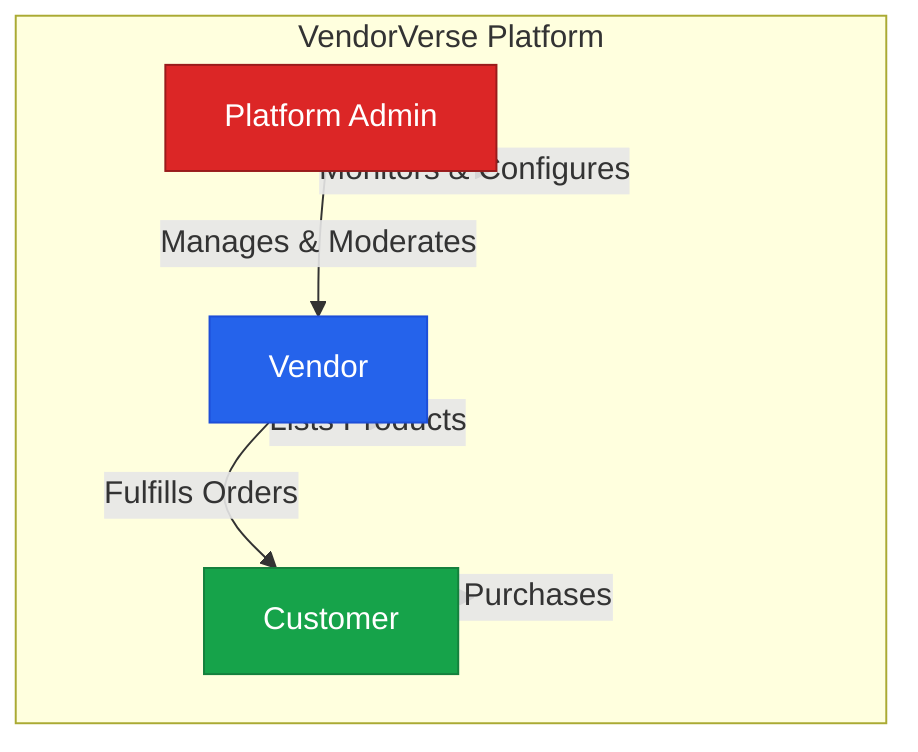

# VendorVerse — Project Overview

> **Document Version:** 1.0  
> **Last Updated:** 2026-07-22  
> **Status:** Approved  
> **Related Documents:** [Software Requirements](./02-software-requirements.md) · [System Architecture](./03-system-architecture.md) · [Development Roadmap](./15-development-roadmap.md)

---

## 1. Executive Summary

**VendorVerse** is an enterprise-grade, multi-vendor marketplace web application built on Django. It enables independent vendors to establish digital storefronts, list products, and manage order fulfillment within a unified platform. Customers enjoy a seamless shopping experience across multiple vendors with a single cart and checkout flow. The platform operator earns revenue through vendor commissions, featured listings, and tiered subscription plans.

The project is designed as a production-ready Django capstone that demonstrates mastery of full-stack web development, system architecture, security, and scalable application design.

---

## 2. Business Problem

### 2.1 Problem Statement

Independent small-to-medium vendors face significant barriers entering e-commerce:

| Barrier | Impact |
|---|---|
| **High setup cost** | Building and maintaining an individual e-commerce store requires significant upfront investment in development, hosting, and payment infrastructure |
| **Customer acquisition** | Independent stores struggle to attract organic traffic; marketing costs are prohibitive for small vendors |
| **Trust deficit** | Customers hesitate to purchase from unknown individual stores due to lack of trust signals (reviews, ratings, platform guarantees) |
| **Operational complexity** | Managing inventory, shipping, payments, customer service, and returns independently is overwhelming |
| **Payment fragmentation** | Setting up merchant accounts, handling multi-currency payments, and managing tax compliance is complex |

### 2.2 Market Opportunity

The global online marketplace industry is projected to exceed $8.8 trillion by 2025, with multi-vendor marketplaces (Amazon, Etsy, Shopify) capturing increasing share. There is a persistent gap for **mid-market, niche-focused** marketplace platforms that:

- Serve specific verticals (crafts, electronics, services, local goods)
- Offer vendors more control and lower commissions than major platforms
- Provide white-label or customizable branding
- Deliver transparent analytics and fair dispute resolution

---

## 3. Business Goals

| Priority | Goal | Success Metric |
|---|---|---|
| **P0** | Enable vendors to list and sell products through a unified platform | ≥50 active vendor storefronts with ≥500 product listings within 6 months of launch |
| **P0** | Provide customers a seamless multi-vendor shopping experience | Cart-to-checkout conversion rate ≥ 3.5% |
| **P0** | Implement secure, automated payment splitting between platform and vendors | 100% of transactions processed with correct commission splits; zero manual payment reconciliation |
| **P1** | Build a trust ecosystem through reviews, ratings, and vendor verification | ≥ 70% of completed orders receive a customer review |
| **P1** | Generate platform revenue through commissions and vendor subscriptions | Positive unit economics per transaction by month 3 |
| **P2** | Provide actionable analytics to vendors and platform admins | Vendors report ≥80% satisfaction with dashboard insights |
| **P2** | Support horizontal scaling as vendor and customer base grows | Platform sustains ≥1,000 concurrent users with <500ms average response time |

---

## 4. Target Users

### 4.1 User Roles

VendorVerse serves three distinct user roles, each with fundamentally different workflows:

| Role | Description | Primary Value |
|---|---|---|
| **Customer** | End-user who browses, compares, and purchases products from multiple vendors | Unified shopping experience with trust guarantees |
| **Vendor** | Business or individual seller who manages a storefront, products, and order fulfillment | Low-barrier access to a customer base with integrated tools |
| **Platform Admin** | Platform operator who manages vendors, moderates content, and configures platform settings | Revenue generation and platform health monitoring |

### 4.2 User Personas

#### Persona 1: Priya — The Customer

| Attribute | Detail |
|---|---|
| **Age** | 28 |
| **Occupation** | Marketing professional |
| **Tech Savvy** | High — shops online regularly |
| **Goals** | Discover unique products from multiple vendors; fast checkout; reliable delivery tracking |
| **Pain Points** | Distrusts unknown stores; frustrated by fragmented carts across vendors; wants unified order history |
| **Behavior** | Compares products across vendors, reads reviews, expects mobile-responsive design, values wishlist functionality |

#### Persona 2: Rajesh — The Vendor

| Attribute | Detail |
|---|---|
| **Age** | 35 |
| **Occupation** | Small business owner (handmade crafts) |
| **Tech Savvy** | Moderate — can use web dashboards but not developer tools |
| **Goals** | Sell products online without building a website; track earnings; manage inventory efficiently |
| **Pain Points** | High commissions on major platforms; limited analytics; no control over branding; slow payouts |
| **Behavior** | Logs in daily to check orders, updates inventory, responds to customer inquiries, monitors sales trends |

#### Persona 3: Ananya — The Platform Admin

| Attribute | Detail |
|---|---|
| **Age** | 32 |
| **Occupation** | Platform operations manager |
| **Tech Savvy** | High — comfortable with dashboards and data |
| **Goals** | Onboard quality vendors; maintain platform integrity; maximize GMV; resolve disputes fairly |
| **Pain Points** | Manual vendor verification is slow; fraudulent listings; difficulty tracking platform-wide metrics |
| **Behavior** | Reviews vendor applications, monitors flagged content, configures commission tiers, generates platform reports |

---

## 5. Scope

### 5.1 In Scope (MVP)

| Module | Key Features |
|---|---|
| **User Management** | Registration, login (email + social), profile management, role-based access |
| **Vendor Management** | Vendor application, storefront setup, verification workflow, subscription tiers |
| **Product Catalog** | Product CRUD, categories, attributes, image management, inventory tracking |
| **Search & Discovery** | Full-text search, category browsing, filters (price, rating, vendor), sorting |
| **Shopping Cart** | Multi-vendor cart, quantity management, cart persistence |
| **Checkout & Payments** | Address management, Stripe Connect integration, commission splitting, order confirmation |
| **Order Management** | Order lifecycle (placed → confirmed → shipped → delivered), tracking, cancellation |
| **Reviews & Ratings** | Product reviews, vendor ratings, review moderation |
| **Vendor Dashboard** | Sales analytics, order management, inventory alerts, earnings reports |
| **Admin Dashboard** | Vendor management, content moderation, commission configuration, platform analytics |
| **Notifications** | Email notifications for order events, vendor approvals, system alerts |

### 5.2 Out of Scope (Future Phases)

| Feature | Rationale for Deferral |
|---|---|
| Mobile native app (iOS/Android) | API-ready architecture supports future mobile development; web-first approach |
| Real-time chat between customer and vendor | Adds WebSocket infrastructure complexity; email messaging sufficient for MVP |
| Multi-language / multi-currency | Internationalization architecture will be prepared but not activated in MVP |
| Auction / bidding system | Niche feature; not core marketplace functionality |
| Vendor advertising / promoted listings (advanced) | Basic featured listings included; programmatic ad system deferred |
| AI-powered recommendations | Requires significant data collection before being effective |
| Affiliate / referral program | Post-launch growth feature |

---

## 6. Assumptions

| ID | Assumption | Impact if Wrong |
|---|---|---|
| A1 | Vendors have basic computer literacy and can operate a web dashboard | Need to invest in vendor onboarding UX and tutorials |
| A2 | English is the primary language for MVP | Internationalization required sooner; architecture must support it |
| A3 | Stripe is available in the target market and supports Connect | Need alternative payment gateway; affects payment architecture |
| A4 | Vendors handle their own shipping and logistics | Platform needs shipping integration (e.g., ShipStation) |
| A5 | Product catalog is primarily physical goods (not digital downloads or services) | Need different fulfillment workflows for digital/service products |
| A6 | Peak concurrent users will not exceed 5,000 in the first year | Horizontal scaling and load balancing needed sooner |
| A7 | PostgreSQL full-text search is sufficient; Elasticsearch not needed for MVP | Search quality may be inadequate for large catalogs |
| A8 | Single geographic region deployment initially | Multi-region deployment and CDN strategy needed sooner |

---

## 7. Constraints

| Type | Constraint | Mitigation |
|---|---|---|
| **Framework** | Django is mandatory | Leverage Django ecosystem fully (DRF, Allauth, Celery integration) |
| **Timeline** | Capstone project with fixed deadline | MVP-first approach; defer non-essential features to future phases |
| **Budget** | Minimal infrastructure budget (capstone context) | Use free tiers (Stripe test mode, free Postgres tiers); Docker for local dev |
| **Team Size** | Single developer or small team | Prioritize code generation tooling, comprehensive documentation, and modular architecture |
| **Compliance** | Basic data protection required (not GDPR/PCI-DSS certified for MVP) | Design architecture to support future compliance; use Stripe for PCI scope reduction |

---

## 8. Success Criteria

### 8.1 Technical Success

| Criteria | Target |
|---|---|
| All critical user flows functional | 100% of MVP user stories implemented and tested |
| Page load time | < 2 seconds (95th percentile) |
| API response time | < 500ms (95th percentile) |
| Test coverage | ≥ 80% (unit + integration) |
| Zero critical security vulnerabilities | Passes OWASP Top 10 review |
| Database query performance | No N+1 queries; all list views use select_related/prefetch_related |

### 8.2 Product Success

| Criteria | Target |
|---|---|
| Vendor onboarding flow completion rate | ≥ 90% of started applications completed |
| Customer checkout conversion | ≥ 3.5% of cart additions reach order placement |
| System uptime | ≥ 99.5% |
| Customer satisfaction (post-purchase) | ≥ 4.0/5.0 average rating |

---

## 9. Risk Assessment

| ID | Risk | Likelihood | Impact | Mitigation |
|---|---|---|---|---|
| R1 | Payment integration complexity delays launch | Medium | High | Use Stripe's well-documented Connect API; build payment module early; create sandbox test suite |
| R2 | Multi-vendor cart/checkout logic introduces edge cases | High | Medium | Extensive unit testing; design cart service with clear vendor separation; handle partial fulfillment |
| R3 | Vendor-uploaded content contains malicious files | Medium | High | File type validation, malware scanning, image re-encoding, content moderation workflow |
| R4 | Poor search quality frustrates customers | Medium | Medium | PostgreSQL trigram + full-text search; monitor search analytics; prepare Elasticsearch migration path |
| R5 | Commission calculation errors cause vendor disputes | Low | Critical | Immutable transaction logs; automated reconciliation; transparent commission display |
| R6 | Scope creep extends timeline | High | High | Strict MVP definition; feature flagging for post-MVP work; documented backlog |
| R7 | Performance degradation with growing catalog | Medium | Medium | Database indexing strategy; query optimization; caching layer; pagination enforcement |

---

## 10. Glossary

| Term | Definition |
|---|---|
| **GMV** | Gross Merchandise Value — total value of goods sold through the platform |
| **SKU** | Stock Keeping Unit — unique identifier for each product variant |
| **Commission** | Percentage of sale price retained by the platform from each vendor transaction |
| **Storefront** | A vendor's branded page within VendorVerse displaying their products and information |
| **Escrow** | Temporary holding of payment funds until order fulfillment conditions are met |
| **DRF** | Django REST Framework — toolkit for building REST APIs in Django |
| **HTMX** | JavaScript library for accessing modern browser features directly from HTML |
| **Allauth** | Django library providing authentication, registration, and social account integration |

---

*Next: [Software Requirements Specification →](./02-software-requirements.md)*
