# VendorVerse — System Architecture

> **Document Version:** 1.0  
> **Last Updated:** 2026-07-22  
> **Status:** Approved  
> **Related Documents:** [Software Requirements](./02-software-requirements.md) · [Database Design](./04-database-design.md) · [Django Architecture](./06-django-architecture.md) · [Security & Performance](./10-security-performance.md)

---

## 1. Architecture Overview

VendorVerse follows a **modular monolith** architecture — a single Django application composed of well-bounded, loosely-coupled Django apps, backed by PostgreSQL, Redis, and Celery for async processing. The frontend is server-rendered using Django Templates enhanced with HTMX for dynamic interactions and Alpine.js for client-side state.

### 1.1 Architectural Decision: Modular Monolith vs. Microservices

| Criterion | Modular Monolith ✅ | Microservices |
|---|---|---|
| **Development Speed** | Single codebase, shared tooling, faster iteration | Requires service mesh, API gateways, distributed tracing |
| **Operational Complexity** | Single deployment unit; simple ops for small team | Requires container orchestration (K8s), service discovery |
| **Data Consistency** | ACID transactions across modules | Eventual consistency; saga pattern complexity |
| **Team Size Fit** | Ideal for 1–5 developers | Requires team-per-service model |
| **Scalability** | Scales vertically + horizontally behind load balancer | Independent service scaling |
| **Migration Path** | Can extract modules to services later | Hard to merge services back into monolith |

**Decision:** Modular monolith. The team size, timeline, and capstone constraints make microservices premature. The modular structure allows future extraction of hot modules (e.g., payments, search) to independent services.

---

## 2. System Context Diagram

This diagram shows VendorVerse's interactions with external systems and actors.

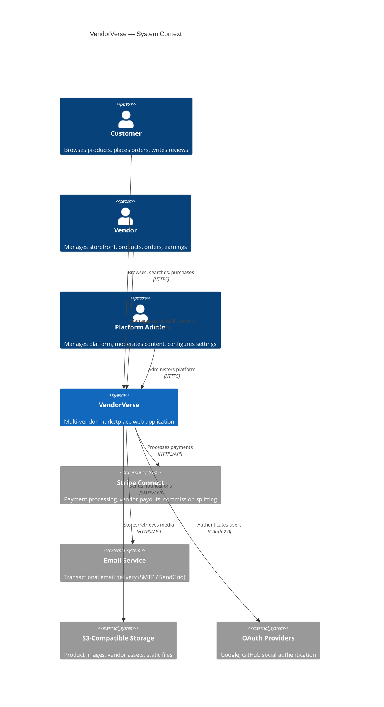

---

## 3. High-Level Architecture

### 3.1 Layered Architecture

VendorVerse employs a **four-layer architecture** that enforces separation of concerns and unidirectional dependency flow.

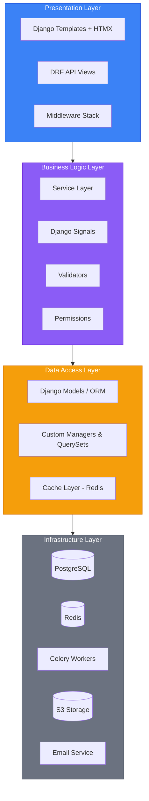

#### Layer Responsibilities

| Layer | Responsibility | May Call | Must Not Call |
|---|---|---|---|
| **Presentation** | HTTP handling, request/response serialization, template rendering, form handling | Business Layer | Data Layer, Infrastructure directly |
| **Business Logic** | Domain rules, validation, orchestration, authorization checks | Data Layer | Presentation Layer |
| **Data Access** | ORM queries, caching, data retrieval/persistence | Infrastructure | Presentation, Business Layer |
| **Infrastructure** | Database, cache, message queue, external APIs, file storage | — | Any upper layer |

**Why this layering matters:** Views call service functions (not models directly for complex operations). This keeps views thin, makes business logic testable without HTTP, and prevents scattered query logic.

### 3.2 Component Architecture

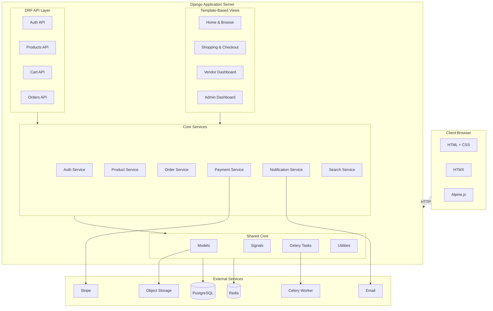

---

## 4. Request Lifecycle

### 4.1 Standard Page Request

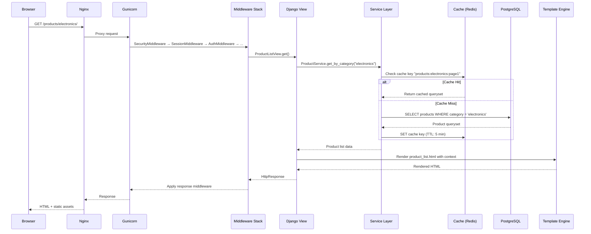

### 4.2 HTMX Partial Request

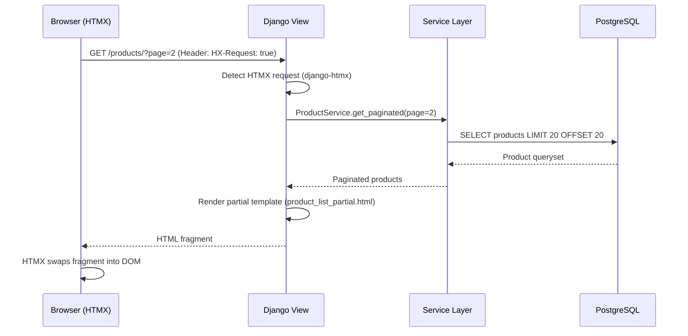

### 4.3 API Request (JWT)

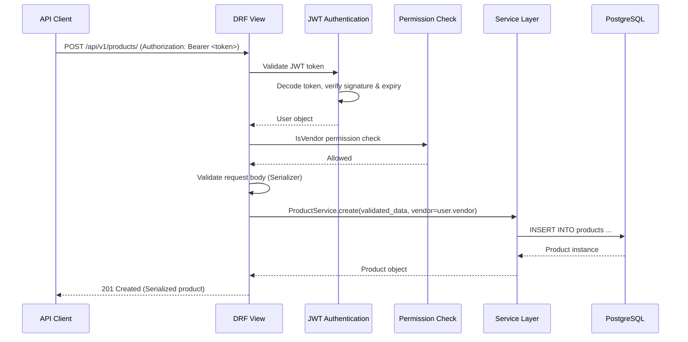

---

## 5. Module Interaction Diagram

This diagram shows how Django apps communicate through defined interfaces.

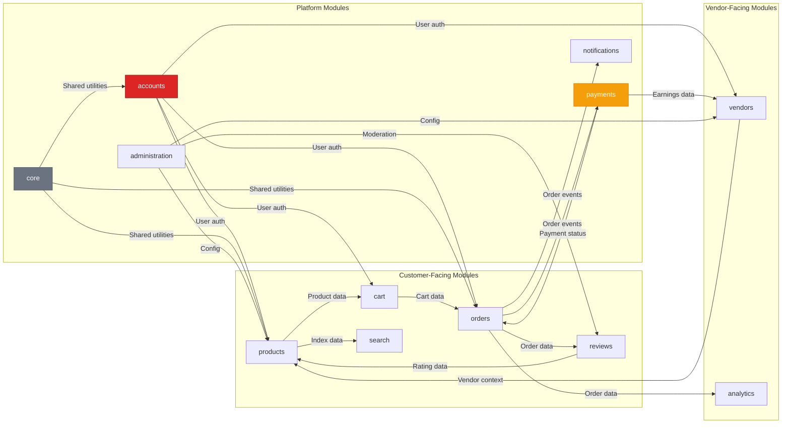

### 5.1 Module Communication Rules

| Rule | Description |
|---|---|
| **Service Layer Calls** | Modules interact through service functions, never by importing each other's models directly (except ForeignKey relations) |
| **Signal-Based Decoupling** | Cross-cutting events (order placed, payment completed) are broadcast via Django signals; interested modules subscribe |
| **No Circular Imports** | Dependency direction is enforced: `core` → `accounts` → `vendors` → `products` → `cart` → `orders` → `payments` |
| **Shared Through Core** | Common utilities, base models, mixins, and constants live in the `core` app |

---

## 6. Data Flow Diagrams

### 6.1 Order Placement Data Flow

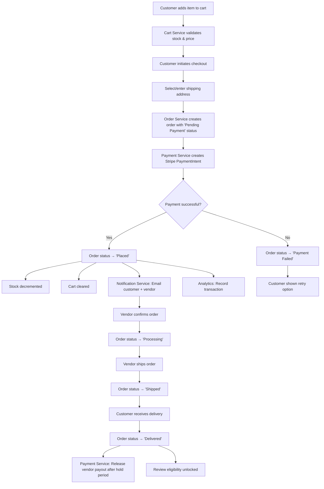

### 6.2 Vendor Onboarding Data Flow

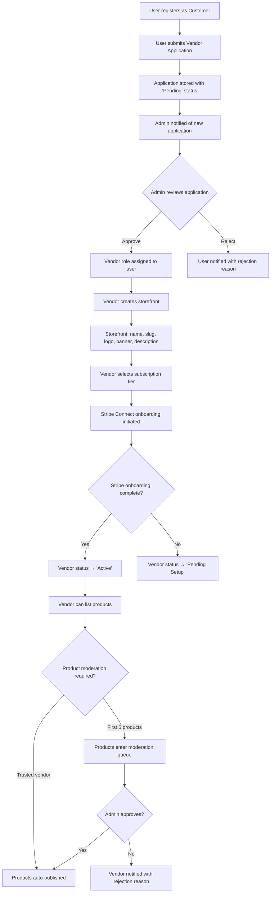

---

## 7. Technology Stack — Detailed Justification

### 7.1 Backend Stack

| Technology | Version | Purpose | Alternatives Considered | Why This Choice |
|---|---|---|---|---|
| **Python** | 3.12+ | Runtime | Node.js, Go | Mandatory (Django); rich ecosystem; excellent readability |
| **Django** | 5.x | Web framework | Flask, FastAPI | Mandatory project requirement; batteries-included; mature ORM, admin, auth |
| **Django REST Framework** | 3.15+ | REST API | Django Ninja, FastAPI | Most mature Django API toolkit; serializers, viewsets, permissions, throttling |
| **PostgreSQL** | 16 | Primary database | MySQL, SQLite | ACID compliance, JSON fields, full-text search, array fields, best Django support |
| **Redis** | 7+ | Cache, broker, sessions | Memcached, RabbitMQ | Multi-purpose (cache + broker + sessions); excellent performance; Django cache backend |
| **Celery** | 5.4+ | Task queue | Django-Q, Huey | Industry standard; Redis broker; robust retry/scheduling; excellent Django integration |
| **Gunicorn** | 22+ | WSGI server | uWSGI, Daphne | Simple config; pre-fork worker model; excellent stability |
| **Nginx** | 1.25+ | Reverse proxy | Caddy, Traefik | Battle-tested; static file serving; SSL termination; rate limiting |

### 7.2 Frontend Stack

| Technology | Purpose | Alternatives Considered | Why This Choice |
|---|---|---|---|
| **Django Templates** | Server-side rendering | Jinja2, React, Vue | Native Django integration; no JS build pipeline; SEO-friendly by default |
| **HTMX** | Dynamic interactions | React, Vue, Turbo | Keeps Django server-rendered paradigm; no JavaScript framework needed; progressive enhancement |
| **Alpine.js** | Client-side reactivity | Vue, jQuery | Minimal footprint (~17kB); declarative; handles UI state HTMX doesn't cover (dropdowns, modals, tabs) |
| **Tailwind CSS 3** | Styling | Bootstrap, Bulma | Utility-first; design consistency; purge removes unused CSS; excellent customization |

#### Why Not a SPA (React/Vue/Next.js)?

| Factor | SPA | Django Templates + HTMX |
|---|---|---|
| Complexity | Separate frontend build, API-only backend, state management, routing | Single codebase, Django handles routing and state |
| SEO | Requires SSR/SSG setup | Server-rendered by default |
| Development speed | Slower (two codebases) | Faster (one codebase, Django forms) |
| Team skills | Requires frontend specialization | Full-stack Django developer sufficient |
| Real-time feel | Excellent | Very good with HTMX (partial page updates) |
| Mobile app readiness | API already exists | API layer (DRF) built alongside for future mobile |

### 7.3 Infrastructure Stack

| Technology | Purpose |
|---|---|
| **Docker** | Containerized development and deployment |
| **Docker Compose** | Local multi-service orchestration |
| **GitHub Actions** | CI/CD pipeline |
| **WhiteNoise** | Static file serving in production (fallback to CDN) |
| **Sentry** | Error tracking and performance monitoring |
| **django-storages** | S3-compatible file storage abstraction |

---

## 8. Authentication & Authorization Architecture

> Detailed in [Authentication & Authorization Document](./09-authentication-authorization.md)

### 8.1 Authentication Flow Overview

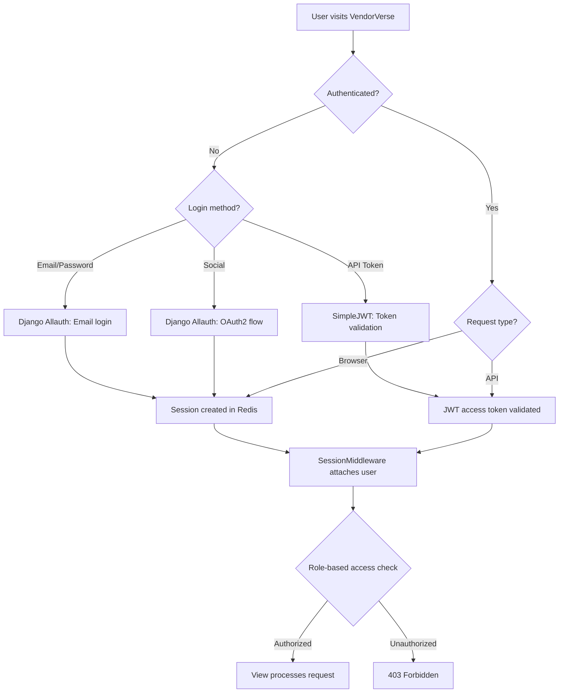

### 8.2 Role-Based Access Control

| Resource | Customer | Vendor | Admin |
|---|---|---|---|
| Browse products | ✅ | ✅ | ✅ |
| Place orders | ✅ | ✅ | ❌ |
| Manage own profile | ✅ | ✅ | ✅ |
| Create/edit products | ❌ | ✅ (own) | ✅ (all) |
| Manage storefront | ❌ | ✅ (own) | ✅ (all) |
| View vendor dashboard | ❌ | ✅ (own) | ✅ (all) |
| Approve vendors | ❌ | ❌ | ✅ |
| Moderate content | ❌ | ❌ | ✅ |
| Platform configuration | ❌ | ❌ | ✅ |
| View admin dashboard | ❌ | ❌ | ✅ |
| Write reviews | ✅ | ✅ | ❌ |
| Manage orders | ✅ (own) | ✅ (own) | ✅ (all) |

---

## 9. Caching Architecture

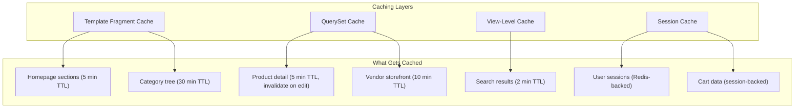

### 9.1 Cache Invalidation Strategy

| Event | Cache Keys Invalidated |
|---|---|
| Product created/updated/deleted | `product:{id}`, `products:category:{cat_id}:*`, `search:*`, `vendor:{vendor_id}:products` |
| Order placed | `product:{id}:stock` for each item |
| Review submitted | `product:{id}`, `product:{id}:reviews`, `vendor:{vendor_id}:rating` |
| Category updated | `categories:tree`, `products:category:{cat_id}:*` |
| Vendor updated | `vendor:{vendor_id}:*`, `storefront:{slug}` |

**Invalidation mechanism:** Django signals trigger cache invalidation in the service layer. Key naming convention: `vendorverse:{app}:{entity}:{id}:{view}`.

---

## 10. Asynchronous Task Architecture

### 10.1 Celery Task Categories

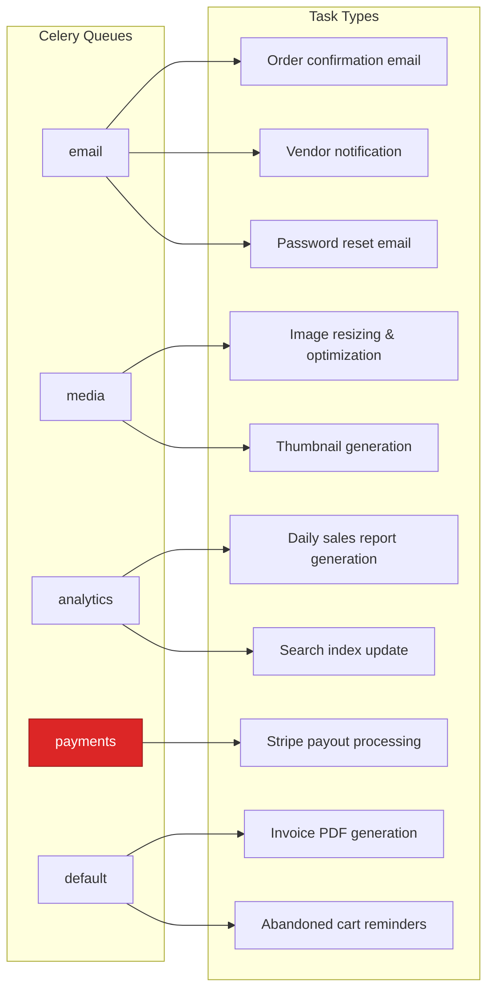

### 10.2 Task Reliability

| Strategy | Implementation |
|---|---|
| **Retry policy** | Exponential backoff; max 3 retries; dead letter queue for failures |
| **Idempotency** | Tasks use idempotency keys (order ID, notification ID) to prevent duplicate processing |
| **Priority queues** | Payment tasks > Email tasks > Media processing > Analytics |
| **Monitoring** | Flower dashboard for queue monitoring; Sentry for task error tracking |
| **Result backend** | Redis (short-lived results, 1 hour TTL) |

---

## 11. Deployment Architecture

### 11.1 Production Architecture

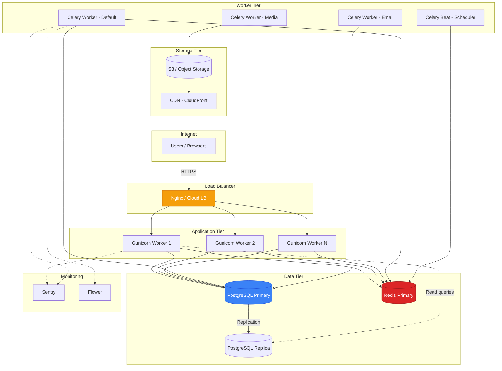

### 11.2 Docker Compose Services (Development)

| Service | Image | Port | Purpose |
|---|---|---|---|
| `web` | Custom (Dockerfile) | 8000 | Django development server |
| `db` | postgres:16-alpine | 5432 | PostgreSQL database |
| `redis` | redis:7-alpine | 6379 | Cache, session store, Celery broker |
| `celery` | Custom (same as web) | — | Async task worker |
| `celery-beat` | Custom (same as web) | — | Periodic task scheduler |
| `mailpit` | axllent/mailpit | 8025 | Local email testing (web UI) |

---

## 12. Error Handling Strategy

### 12.1 Error Handling Layers

| Layer | Strategy |
|---|---|
| **View Layer** | Django's exception handling; custom error templates (400, 403, 404, 500); DRF exception handler for API |
| **Service Layer** | Custom exception classes (e.g., `InsufficientStockError`, `PaymentFailedError`); caught and translated to HTTP responses in views |
| **Task Layer** | Celery retry with exponential backoff; dead letter queue; Sentry alerting on final failure |
| **Database Layer** | Transaction rollback on error; `select_for_update` for race conditions; constraint violation → user-friendly message |
| **External API Layer** | Circuit breaker pattern for Stripe; timeout configuration; fallback behavior (queue for retry) |

### 12.2 Custom Exception Hierarchy

```
VendorVerseException (base)
├── ValidationError
│   ├── InsufficientStockError
│   ├── InvalidCouponError
│   └── DuplicateReviewError
├── AuthorizationError
│   ├── VendorNotApprovedError
│   └── OrderAccessDeniedError
├── PaymentError
│   ├── PaymentFailedError
│   ├── RefundFailedError
│   └── PayoutFailedError
├── ExternalServiceError
│   ├── StripeConnectionError
│   ├── EmailDeliveryError
│   └── StorageUploadError
└── BusinessRuleError
    ├── OrderCancellationNotAllowedError
    ├── VendorSuspendedError
    └── ProductModerationRequiredError
```

---

## 13. Logging Strategy

### 13.1 Log Levels and Usage

| Level | Usage | Example |
|---|---|---|
| `DEBUG` | Detailed diagnostic info (dev only) | Query execution details, cache hit/miss |
| `INFO` | Normal operational events | User login, order placed, payment processed |
| `WARNING` | Unexpected but handled conditions | Cache miss, slow query detected, rate limit approached |
| `ERROR` | Errors requiring attention | Payment failed, email delivery failed, external API timeout |
| `CRITICAL` | System-level failures | Database connection lost, Redis unavailable |

### 13.2 Structured Logging Format

```json
{
  "timestamp": "2026-07-22T12:00:00Z",
  "level": "INFO",
  "logger": "vendorverse.orders.services",
  "message": "Order placed successfully",
  "context": {
    "order_id": "ORD-20260722-0001",
    "customer_id": 42,
    "vendor_ids": [5, 12],
    "total_amount": "149.99",
    "payment_method": "stripe",
    "request_id": "req_abc123"
  }
}
```

### 13.3 Log Routing

| Log Source | Destination | Retention |
|---|---|---|
| Application logs | stdout → log aggregator | 30 days |
| Access logs (Nginx) | File → log aggregator | 30 days |
| Audit logs (auth events) | Database (AuditLog model) | 1 year |
| Error logs | Sentry | Per Sentry plan |
| Celery task logs | stdout → log aggregator | 30 days |

---

## 14. Monitoring Strategy

| Metric Category | Tool | Key Metrics |
|---|---|---|
| **Error Tracking** | Sentry | Exception rate, error trends, affected users |
| **Application Performance** | Sentry Performance | Response times, throughput, slow transactions |
| **Infrastructure** | Docker stats / Cloud monitoring | CPU, memory, disk, network |
| **Database** | pg_stat_statements | Slow queries, connection count, cache hit ratio |
| **Cache** | Redis INFO | Hit rate, memory usage, eviction rate |
| **Task Queue** | Flower | Queue depth, task success/failure rate, worker utilization |
| **Uptime** | UptimeRobot (free tier) | Endpoint availability, response time |

---

## 15. Architectural Decision Records (ADRs)

### ADR-001: Session Storage in Redis

**Context:** Django's default database-backed sessions add a query per request.  
**Decision:** Store sessions in Redis using `django.contrib.sessions.backends.cache`.  
**Consequences:** Faster session lookups (<1ms vs ~5ms); sessions lost if Redis is flushed (acceptable — users re-login); Redis becomes a critical dependency.

### ADR-002: Service Layer Pattern

**Context:** Business logic scattered across views, models, and serializers leads to fat models, untestable views, and duplicated logic between template views and API views.  
**Decision:** Introduce a service layer (`services.py` in each app) that encapsulates business logic. Views and serializers delegate to services.  
**Consequences:** Slightly more boilerplate; but testable business logic, DRY across template and API views, clear separation of concerns.

### ADR-003: HTMX Over SPA Framework

**Context:** Need dynamic interactions (pagination, search, cart updates) without full page reloads.  
**Decision:** Use HTMX for server-driven partial updates instead of React/Vue SPA.  
**Consequences:** No JavaScript build pipeline; Django templates remain the rendering layer; API still built (DRF) for future mobile app; slight learning curve for HTMX patterns.

### ADR-004: Stripe Connect for Marketplace Payments

**Context:** Multi-vendor marketplace requires split payments between platform and vendors.  
**Decision:** Use Stripe Connect (Standard accounts) for automated payment splitting.  
**Consequences:** Stripe handles vendor onboarding, KYC, and payouts; platform collects commission automatically; vendor receives payout on Stripe's schedule; dependency on Stripe availability.

### ADR-005: PostgreSQL Full-Text Search Over Elasticsearch

**Context:** Product search needs to be fast, typo-tolerant, and relevant.  
**Decision:** Use PostgreSQL's built-in full-text search with trigram extension for MVP.  
**Consequences:** No additional infrastructure; good enough for catalogs <100k products; migration path to Elasticsearch documented if search quality becomes insufficient.

### ADR-006: Shared Schema Multi-Tenancy

**Context:** Vendors need data isolation for their products, orders, and earnings.  
**Decision:** Single database, shared schema. Vendor isolation enforced through foreign keys and query filtering in the service layer.  
**Consequences:** Simple architecture; ACID transactions across vendors; tenant isolation is application-enforced (risk of bugs leaking data — mitigated by service layer + tests); no need for complex schema routing.

---

*← [Software Requirements](./02-software-requirements.md) · Next: [Database Design →](./04-database-design.md)*
