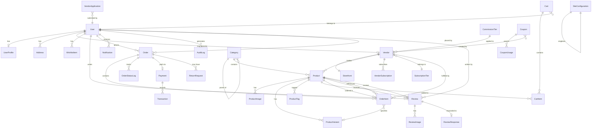
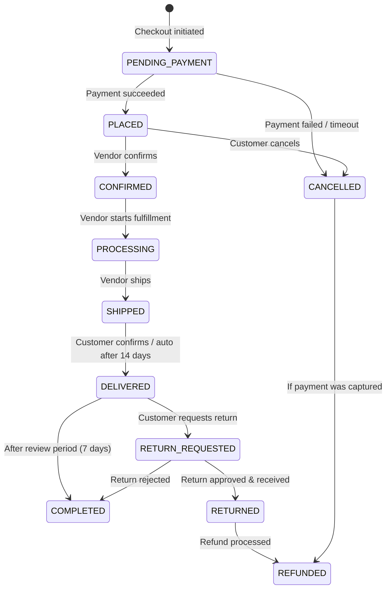

# VendorVerse — Database Design

> **Document Version:** 1.0  
> **Last Updated:** 2026-07-22  
> **Status:** Approved  
> **Related Documents:** [Software Requirements](./02-software-requirements.md) · [System Architecture](./03-system-architecture.md) · [Django Architecture](./06-django-architecture.md)

---

## 1. Database Strategy

### 1.1 Technology Choice: PostgreSQL 16

| Criterion | PostgreSQL | MySQL | SQLite |
|---|---|---|---|
| Django support | First-class (recommended by Django) | Good | Dev only |
| ACID compliance | Full | Full (InnoDB) | Full |
| JSON fields | Native JSONB with indexing | JSON type (limited indexing) | No native JSON |
| Full-text search | Built-in (ts_vector, ts_query, trigram) | Basic FULLTEXT | No |
| Array fields | Native | No | No |
| Concurrent writes | MVCC (excellent) | Row-level locking | File-level locking |
| Django ORM features | Full (all field types, expressions, lookups) | Most features | Limited |

### 1.2 Design Principles

- **Normalization:** 3NF as the baseline; selective denormalization for read-heavy views (e.g., cached rating on Product)
- **Soft Deletes:** Critical entities (User, Vendor, Product, Order) use `is_active` flag instead of hard deletes
- **Audit Trails:** All financial entities (Order, Payment, Transaction) maintain immutable status logs
- **UUID vs Integer PKs:** Integer auto-increment primary keys for performance; UUID exposed as public-facing identifiers (`public_id`) to prevent enumeration
- **Timestamps:** All models include `created_at` and `updated_at` via abstract base model

---

## 2. Entity-Relationship Diagram

---

## 3. Schema Definitions

### 3.1 Core App — Abstract Base Models

#### `TimeStampedModel` (Abstract)

All models inherit from this base.

| Field | Type | Constraints | Description |
|---|---|---|---|
| `created_at` | DateTimeField | auto_now_add=True | Record creation timestamp |
| `updated_at` | DateTimeField | auto_now=True | Last modification timestamp |

#### `PublicIDModel` (Abstract)

Entities exposed in URLs inherit this.

| Field | Type | Constraints | Description |
|---|---|---|---|
| `public_id` | UUIDField | unique, default=uuid4, editable=False | Public-facing identifier (prevents PK enumeration) |

---

### 3.2 Accounts App

#### `User` (extends AbstractUser)

| Field | Type | Constraints | Description |
|---|---|---|---|
| `id` | BigAutoField | PK | Internal identifier |
| `email` | EmailField | unique, indexed | Login credential (used instead of username) |
| `username` | CharField | unique, max_length=150 | Auto-generated from email; kept for Django compat |
| `first_name` | CharField | max_length=150 | User's first name |
| `last_name` | CharField | max_length=150 | User's last name |
| `role` | CharField | choices=[CUSTOMER, VENDOR, ADMIN], default=CUSTOMER | Primary role |
| `is_email_verified` | BooleanField | default=False | Email verification status |
| `avatar` | ImageField | upload_to='avatars/', null=True | Profile picture |
| `phone` | CharField | max_length=20, null=True | Contact phone |
| `date_joined` | DateTimeField | auto_now_add=True | Registration timestamp |
| `last_login` | DateTimeField | null=True | Last login timestamp |
| `is_active` | BooleanField | default=True | Soft delete flag |

**Indexes:** `email` (unique), `role`, `is_active`, `date_joined`  
**Custom Manager:** `UserManager` — overrides `create_user` to use email as primary identifier

#### `UserProfile`

| Field | Type | Constraints | Description |
|---|---|---|---|
| `user` | OneToOneField(User) | PK, on_delete=CASCADE | Profile owner |
| `bio` | TextField | max_length=500, blank=True | Short biography |
| `date_of_birth` | DateField | null=True | Optional date of birth |
| `notification_preferences` | JSONField | default=dict | Per-category notification settings |
| `recently_viewed` | JSONField | default=list | Last 50 viewed product IDs |

#### `Address`

| Field | Type | Constraints | Description |
|---|---|---|---|
| `id` | BigAutoField | PK | Internal identifier |
| `public_id` | UUIDField | unique | Public identifier |
| `user` | ForeignKey(User) | on_delete=CASCADE, indexed | Address owner |
| `label` | CharField | max_length=50 | Friendly name (e.g., "Home", "Office") |
| `full_name` | CharField | max_length=200 | Recipient name |
| `phone` | CharField | max_length=20 | Contact phone |
| `address_line_1` | CharField | max_length=255 | Street address |
| `address_line_2` | CharField | max_length=255, blank=True | Apt/suite/floor |
| `city` | CharField | max_length=100 | City |
| `state` | CharField | max_length=100 | State/province |
| `postal_code` | CharField | max_length=20 | ZIP/postal code |
| `country` | CharField | max_length=2 | ISO 3166-1 alpha-2 country code |
| `is_default` | BooleanField | default=False | Default shipping address |
| `is_active` | BooleanField | default=True | Soft delete |

**Indexes:** `(user, is_default)`, `(user, is_active)`  
**Constraints:** Only one `is_default=True` per user (enforced in service layer)

#### `AuditLog`

| Field | Type | Constraints | Description |
|---|---|---|---|
| `id` | BigAutoField | PK | Internal identifier |
| `user` | ForeignKey(User) | on_delete=SET_NULL, null=True | Actor |
| `action` | CharField | max_length=50 | Action type (LOGIN, LOGOUT, PASSWORD_CHANGE, FAILED_LOGIN) |
| `ip_address` | GenericIPAddressField | | Client IP |
| `user_agent` | TextField | | Browser user agent |
| `metadata` | JSONField | default=dict | Additional context |
| `created_at` | DateTimeField | auto_now_add=True, indexed | Event timestamp |

**Indexes:** `(user, action)`, `created_at`, `ip_address`

---

### 3.3 Vendors App

#### `VendorApplication`

| Field | Type | Constraints | Description |
|---|---|---|---|
| `id` | BigAutoField | PK | Internal identifier |
| `public_id` | UUIDField | unique | Public identifier |
| `user` | ForeignKey(User) | on_delete=CASCADE | Applicant |
| `business_name` | CharField | max_length=200 | Proposed business name |
| `business_description` | TextField | | Description of business |
| `business_type` | CharField | choices=[INDIVIDUAL, COMPANY] | Business entity type |
| `tax_id` | CharField | max_length=50, blank=True | Tax identification number |
| `website` | URLField | blank=True | Existing website |
| `status` | CharField | choices=[PENDING, APPROVED, REJECTED], default=PENDING | Application status |
| `reviewed_by` | ForeignKey(User) | null=True, on_delete=SET_NULL | Admin reviewer |
| `reviewed_at` | DateTimeField | null=True | Review timestamp |
| `rejection_reason` | TextField | blank=True | Reason if rejected |

**Indexes:** `status`, `(user, status)`, `created_at`

#### `Vendor`

| Field | Type | Constraints | Description |
|---|---|---|---|
| `id` | BigAutoField | PK | Internal identifier |
| `public_id` | UUIDField | unique | Public identifier |
| `user` | OneToOneField(User) | on_delete=CASCADE | Vendor user account |
| `business_name` | CharField | max_length=200, unique | Official business name |
| `slug` | SlugField | max_length=220, unique | URL slug for storefront |
| `status` | CharField | choices=[PENDING_SETUP, ACTIVE, SUSPENDED, BANNED] | Vendor account status |
| `commission_rate` | DecimalField | max_digits=5, decimal_places=2, default=5.00 | Current commission percentage |
| `subscription_tier` | ForeignKey(SubscriptionTier) | on_delete=PROTECT | Current subscription |
| `stripe_account_id` | CharField | max_length=100, blank=True | Stripe Connect account |
| `is_verified` | BooleanField | default=False | Verified vendor badge |
| `total_earnings` | DecimalField | max_digits=12, decimal_places=2, default=0 | Lifetime earnings (denormalized) |
| `pending_earnings` | DecimalField | max_digits=12, decimal_places=2, default=0 | Awaiting payout |
| `available_earnings` | DecimalField | max_digits=12, decimal_places=2, default=0 | Ready for withdrawal |
| `product_count` | PositiveIntegerField | default=0 | Denormalized product count |
| `average_rating` | DecimalField | max_digits=3, decimal_places=2, default=0 | Denormalized avg rating |

**Indexes:** `slug`, `status`, `is_verified`, `(status, average_rating)`

#### `Storefront`

| Field | Type | Constraints | Description |
|---|---|---|---|
| `vendor` | OneToOneField(Vendor) | PK, on_delete=CASCADE | Owner vendor |
| `tagline` | CharField | max_length=200, blank=True | Short tagline |
| `description` | TextField | blank=True | Full storefront description |
| `logo` | ImageField | upload_to='storefronts/logos/' | Store logo |
| `banner` | ImageField | upload_to='storefronts/banners/' | Store banner image |
| `return_policy` | TextField | blank=True | Vendor return policy |
| `shipping_policy` | TextField | blank=True | Shipping information |
| `terms` | TextField | blank=True | Vendor terms of service |

#### `SubscriptionTier`

| Field | Type | Constraints | Description |
|---|---|---|---|
| `id` | BigAutoField | PK | Internal identifier |
| `name` | CharField | max_length=50, unique | Tier name (Free, Standard, Premium) |
| `commission_rate` | DecimalField | max_digits=5, decimal_places=2 | Commission percentage |
| `max_products` | PositiveIntegerField | | Maximum product listings (0 = unlimited) |
| `price_monthly` | DecimalField | max_digits=8, decimal_places=2 | Monthly subscription price |
| `features` | JSONField | default=list | Feature list for display |
| `is_active` | BooleanField | default=True | Available for selection |
| `sort_order` | PositiveSmallIntegerField | default=0 | Display ordering |

---

### 3.4 Products App

#### `Category`

| Field | Type | Constraints | Description |
|---|---|---|---|
| `id` | BigAutoField | PK | Internal identifier |
| `public_id` | UUIDField | unique | Public identifier |
| `name` | CharField | max_length=100 | Category name |
| `slug` | SlugField | max_length=120, unique | URL slug |
| `parent` | ForeignKey(self) | null=True, blank=True, on_delete=CASCADE | Parent category (3 levels max) |
| `description` | TextField | blank=True | Category description |
| `icon` | CharField | max_length=50, blank=True | Icon class name |
| `image` | ImageField | upload_to='categories/', null=True | Category image |
| `sort_order` | PositiveSmallIntegerField | default=0 | Display ordering |
| `is_active` | BooleanField | default=True | Visibility flag |
| `product_count` | PositiveIntegerField | default=0 | Denormalized count |

**Indexes:** `slug`, `parent`, `(is_active, sort_order)`, `(parent, sort_order)`

#### `Product`

| Field | Type | Constraints | Description |
|---|---|---|---|
| `id` | BigAutoField | PK | Internal identifier |
| `public_id` | UUIDField | unique | Public identifier |
| `vendor` | ForeignKey(Vendor) | on_delete=CASCADE, indexed | Selling vendor |
| `category` | ForeignKey(Category) | on_delete=PROTECT, indexed | Product category |
| `title` | CharField | max_length=200 | Product title |
| `slug` | SlugField | max_length=220 | URL slug (unique with vendor) |
| `description` | TextField | | Full product description |
| `short_description` | CharField | max_length=300, blank=True | Summary for listings |
| `price` | DecimalField | max_digits=10, decimal_places=2 | Current selling price |
| `compare_at_price` | DecimalField | max_digits=10, decimal_places=2, null=True | Original price (for sale display) |
| `cost_price` | DecimalField | max_digits=10, decimal_places=2, null=True | Cost to vendor (private) |
| `sku` | CharField | max_length=100 | Stock Keeping Unit |
| `stock_quantity` | PositiveIntegerField | default=0 | Available stock |
| `low_stock_threshold` | PositiveIntegerField | default=10 | Alert threshold |
| `weight` | DecimalField | max_digits=8, decimal_places=2, null=True | Weight in grams |
| `status` | CharField | choices=[DRAFT, PENDING_REVIEW, PUBLISHED, OUT_OF_STOCK, SUSPENDED, ARCHIVED] | Product lifecycle status |
| `is_featured` | BooleanField | default=False | Featured product flag |
| `average_rating` | DecimalField | max_digits=3, decimal_places=2, default=0 | Denormalized avg rating |
| `review_count` | PositiveIntegerField | default=0 | Denormalized review count |
| `total_sold` | PositiveIntegerField | default=0 | Denormalized sales count |
| `attributes` | JSONField | default=dict | Flexible product attributes |
| `meta_title` | CharField | max_length=70, blank=True | SEO title |
| `meta_description` | CharField | max_length=160, blank=True | SEO description |
| `search_vector` | SearchVectorField | null=True | PostgreSQL full-text search vector |

**Indexes:** `public_id`, `(vendor, slug)` unique together, `category`, `status`, `price`, `average_rating`, `is_featured`, `search_vector` (GIN index), `created_at`  
**Full-text search:** GIN index on `search_vector` (populated via trigger/signal from title + description + tags)

#### `ProductImage`

| Field | Type | Constraints | Description |
|---|---|---|---|
| `id` | BigAutoField | PK | Internal identifier |
| `product` | ForeignKey(Product) | on_delete=CASCADE | Parent product |
| `image` | ImageField | upload_to='products/' | Image file |
| `alt_text` | CharField | max_length=200, blank=True | Accessibility alt text |
| `sort_order` | PositiveSmallIntegerField | default=0 | Display ordering |
| `is_primary` | BooleanField | default=False | Primary display image |

**Constraints:** Max 10 images per product; exactly one `is_primary=True` per product

#### `ProductVariant`

| Field | Type | Constraints | Description |
|---|---|---|---|
| `id` | BigAutoField | PK | Internal identifier |
| `product` | ForeignKey(Product) | on_delete=CASCADE | Parent product |
| `name` | CharField | max_length=100 | Variant label (e.g., "Large / Blue") |
| `sku` | CharField | max_length=100, unique | Variant SKU |
| `price_override` | DecimalField | max_digits=10, decimal_places=2, null=True | Price if different from base |
| `stock_quantity` | PositiveIntegerField | default=0 | Variant stock |
| `attributes` | JSONField | default=dict | Variant attributes (size, color, etc.) |
| `is_active` | BooleanField | default=True | Availability flag |

#### `ProductTag`

| Field | Type | Constraints | Description |
|---|---|---|---|
| `id` | BigAutoField | PK | Internal identifier |
| `name` | CharField | max_length=50, unique | Tag text |
| `slug` | SlugField | max_length=60, unique | URL slug |

**Relation:** ManyToMany with Product via `product_tags` join table

---

### 3.5 Cart App

#### `Cart`

| Field | Type | Constraints | Description |
|---|---|---|---|
| `id` | BigAutoField | PK | Internal identifier |
| `user` | OneToOneField(User) | on_delete=CASCADE, null=True | Authenticated user |
| `session_key` | CharField | max_length=40, null=True, indexed | Anonymous session |
| `updated_at` | DateTimeField | auto_now=True | Last modification |

**Constraints:** Either `user` or `session_key` must be set (not both null)

#### `CartItem`

| Field | Type | Constraints | Description |
|---|---|---|---|
| `id` | BigAutoField | PK | Internal identifier |
| `cart` | ForeignKey(Cart) | on_delete=CASCADE | Parent cart |
| `product` | ForeignKey(Product) | on_delete=CASCADE | Product added |
| `variant` | ForeignKey(ProductVariant) | on_delete=SET_NULL, null=True | Selected variant |
| `quantity` | PositiveIntegerField | default=1 | Item quantity |
| `added_at` | DateTimeField | auto_now_add=True | When added to cart |

**Constraints:** `(cart, product, variant)` unique together

---

### 3.6 Orders App

#### `Order`

| Field | Type | Constraints | Description |
|---|---|---|---|
| `id` | BigAutoField | PK | Internal identifier |
| `public_id` | UUIDField | unique | Public order ID |
| `order_number` | CharField | max_length=20, unique | Human-readable order number (e.g., "ORD-20260722-0001") |
| `customer` | ForeignKey(User) | on_delete=PROTECT, indexed | Ordering customer |
| `status` | CharField | choices=[PENDING_PAYMENT, PLACED, CONFIRMED, PARTIALLY_SHIPPED, SHIPPED, DELIVERED, COMPLETED, CANCELLED, REFUNDED] | Overall order status |
| `shipping_address` | JSONField | | Snapshot of shipping address at order time |
| `subtotal` | DecimalField | max_digits=12, decimal_places=2 | Items total before fees |
| `shipping_total` | DecimalField | max_digits=8, decimal_places=2, default=0 | Total shipping cost |
| `tax_total` | DecimalField | max_digits=8, decimal_places=2, default=0 | Total tax |
| `discount_total` | DecimalField | max_digits=8, decimal_places=2, default=0 | Total discounts |
| `grand_total` | DecimalField | max_digits=12, decimal_places=2 | Final amount charged |
| `currency` | CharField | max_length=3, default='USD' | ISO 4217 currency |
| `notes` | TextField | blank=True | Customer order notes |
| `ip_address` | GenericIPAddressField | null=True | Customer IP at order time |
| `placed_at` | DateTimeField | null=True | When order was placed |
| `completed_at` | DateTimeField | null=True | When order was completed |

**Indexes:** `order_number`, `customer`, `status`, `placed_at`, `(customer, status)`

#### `OrderItem`

| Field | Type | Constraints | Description |
|---|---|---|---|
| `id` | BigAutoField | PK | Internal identifier |
| `public_id` | UUIDField | unique | Public identifier |
| `order` | ForeignKey(Order) | on_delete=CASCADE | Parent order |
| `vendor` | ForeignKey(Vendor) | on_delete=PROTECT | Fulfilling vendor |
| `product` | ForeignKey(Product) | on_delete=PROTECT | Ordered product |
| `variant` | ForeignKey(ProductVariant) | on_delete=SET_NULL, null=True | Selected variant |
| `product_title` | CharField | max_length=200 | Snapshot of product title |
| `product_price` | DecimalField | max_digits=10, decimal_places=2 | Price at time of order |
| `quantity` | PositiveIntegerField | | Ordered quantity |
| `line_total` | DecimalField | max_digits=12, decimal_places=2 | quantity × price |
| `commission_rate` | DecimalField | max_digits=5, decimal_places=2 | Commission rate at order time |
| `commission_amount` | DecimalField | max_digits=10, decimal_places=2 | Platform commission |
| `vendor_earning` | DecimalField | max_digits=10, decimal_places=2 | Vendor's net earning |
| `status` | CharField | choices=[PENDING, CONFIRMED, PROCESSING, SHIPPED, DELIVERED, CANCELLED, RETURNED] | Per-item status |
| `tracking_number` | CharField | max_length=100, blank=True | Shipping tracking number |
| `tracking_carrier` | CharField | max_length=50, blank=True | Shipping carrier name |
| `shipped_at` | DateTimeField | null=True | Shipment timestamp |
| `delivered_at` | DateTimeField | null=True | Delivery timestamp |

**Indexes:** `order`, `vendor`, `product`, `status`, `(vendor, status)`

#### `OrderStatusLog`

| Field | Type | Constraints | Description |
|---|---|---|---|
| `id` | BigAutoField | PK | Internal identifier |
| `order` | ForeignKey(Order) | on_delete=CASCADE | Related order |
| `order_item` | ForeignKey(OrderItem) | on_delete=CASCADE, null=True | Related item (if item-level change) |
| `from_status` | CharField | max_length=30 | Previous status |
| `to_status` | CharField | max_length=30 | New status |
| `changed_by` | ForeignKey(User) | on_delete=SET_NULL, null=True | Actor |
| `notes` | TextField | blank=True | Change notes |
| `created_at` | DateTimeField | auto_now_add=True | Change timestamp |

#### `ReturnRequest`

| Field | Type | Constraints | Description |
|---|---|---|---|
| `id` | BigAutoField | PK | Internal identifier |
| `public_id` | UUIDField | unique | Public identifier |
| `order_item` | ForeignKey(OrderItem) | on_delete=CASCADE | Item being returned |
| `reason` | CharField | choices=[DEFECTIVE, WRONG_ITEM, NOT_AS_DESCRIBED, CHANGED_MIND, OTHER] | Return reason |
| `description` | TextField | | Detailed description |
| `status` | CharField | choices=[REQUESTED, APPROVED, REJECTED, COMPLETED] | Return status |
| `resolved_by` | ForeignKey(User) | null=True, on_delete=SET_NULL | Resolver (vendor/admin) |
| `resolution_notes` | TextField | blank=True | Resolution details |

---

### 3.7 Payments App

#### `Payment`

| Field | Type | Constraints | Description |
|---|---|---|---|
| `id` | BigAutoField | PK | Internal identifier |
| `public_id` | UUIDField | unique | Public identifier |
| `order` | OneToOneField(Order) | on_delete=PROTECT | Related order |
| `stripe_payment_intent_id` | CharField | max_length=100, unique | Stripe PaymentIntent ID |
| `amount` | DecimalField | max_digits=12, decimal_places=2 | Total charged |
| `currency` | CharField | max_length=3 | ISO 4217 |
| `status` | CharField | choices=[PENDING, SUCCEEDED, FAILED, REFUNDED, PARTIALLY_REFUNDED] | Payment status |
| `payment_method` | CharField | max_length=50 | Payment method type (card, etc.) |
| `paid_at` | DateTimeField | null=True | Successful payment timestamp |
| `metadata` | JSONField | default=dict | Additional payment metadata |

#### `Transaction`

| Field | Type | Constraints | Description |
|---|---|---|---|
| `id` | BigAutoField | PK | Internal identifier |
| `payment` | ForeignKey(Payment) | on_delete=CASCADE | Parent payment |
| `type` | CharField | choices=[CHARGE, REFUND, PAYOUT, COMMISSION] | Transaction type |
| `amount` | DecimalField | max_digits=12, decimal_places=2 | Transaction amount |
| `vendor` | ForeignKey(Vendor) | null=True, on_delete=SET_NULL | Related vendor |
| `stripe_transfer_id` | CharField | max_length=100, blank=True | Stripe Transfer ID |
| `status` | CharField | choices=[PENDING, COMPLETED, FAILED] | Transaction status |
| `description` | TextField | blank=True | Transaction description |

---

### 3.8 Reviews App

#### `Review`

| Field | Type | Constraints | Description |
|---|---|---|---|
| `id` | BigAutoField | PK | Internal identifier |
| `public_id` | UUIDField | unique | Public identifier |
| `product` | ForeignKey(Product) | on_delete=CASCADE, indexed | Reviewed product |
| `customer` | ForeignKey(User) | on_delete=CASCADE | Review author |
| `order_item` | ForeignKey(OrderItem) | on_delete=SET_NULL, null=True | Purchase that earned review eligibility |
| `rating` | PositiveSmallIntegerField | validators=[1-5] | Star rating |
| `title` | CharField | max_length=100, blank=True | Review headline |
| `body` | TextField | blank=True | Review text |
| `is_verified_purchase` | BooleanField | default=False | Confirmed purchase flag |
| `is_approved` | BooleanField | default=True | Moderation status |
| `helpful_count` | PositiveIntegerField | default=0 | "Was this helpful?" count |

**Indexes:** `product`, `customer`, `rating`, `(product, is_approved)`, `created_at`  
**Constraints:** `(product, customer, order_item)` unique together

#### `ReviewImage`

| Field | Type | Constraints | Description |
|---|---|---|---|
| `id` | BigAutoField | PK | Internal identifier |
| `review` | ForeignKey(Review) | on_delete=CASCADE | Parent review |
| `image` | ImageField | upload_to='reviews/' | Review image |
| `sort_order` | PositiveSmallIntegerField | default=0 | Display order |

**Constraints:** Max 3 images per review

#### `ReviewResponse`

| Field | Type | Constraints | Description |
|---|---|---|---|
| `review` | OneToOneField(Review) | PK, on_delete=CASCADE | Parent review |
| `vendor` | ForeignKey(Vendor) | on_delete=CASCADE | Responding vendor |
| `body` | TextField | | Response text |
| `created_at` | DateTimeField | auto_now_add=True | Response timestamp |

---

### 3.9 Notifications App

#### `Notification`

| Field | Type | Constraints | Description |
|---|---|---|---|
| `id` | BigAutoField | PK | Internal identifier |
| `recipient` | ForeignKey(User) | on_delete=CASCADE, indexed | Notification recipient |
| `type` | CharField | max_length=50 | Notification type (ORDER_PLACED, VENDOR_APPROVED, etc.) |
| `title` | CharField | max_length=200 | Notification title |
| `message` | TextField | | Notification body |
| `link` | CharField | max_length=500, blank=True | Related URL |
| `is_read` | BooleanField | default=False, indexed | Read status |
| `created_at` | DateTimeField | auto_now_add=True, indexed | Creation timestamp |

**Indexes:** `(recipient, is_read)`, `(recipient, created_at)`

#### `NotificationPreference`

| Field | Type | Constraints | Description |
|---|---|---|---|
| `user` | OneToOneField(User) | PK, on_delete=CASCADE | User |
| `preferences` | JSONField | default=dict | Per-type email/in-app preferences |

---

### 3.10 Administration App

#### `SiteConfiguration` (Singleton)

| Field | Type | Constraints | Description |
|---|---|---|---|
| `id` | BigAutoField | PK | Always 1 (singleton) |
| `site_name` | CharField | max_length=100 | Platform name |
| `site_logo` | ImageField | null=True | Platform logo |
| `tagline` | CharField | max_length=200, blank=True | Platform tagline |
| `maintenance_mode` | BooleanField | default=False | Maintenance mode flag |
| `default_commission_rate` | DecimalField | max_digits=5, decimal_places=2 | Default vendor commission |
| `min_payout_amount` | DecimalField | max_digits=8, decimal_places=2, default=50 | Minimum withdrawal |
| `payout_hold_days` | PositiveIntegerField | default=7 | Days to hold payment before vendor payout |
| `homepage_config` | JSONField | default=dict | Homepage sections config |

#### `Coupon`

| Field | Type | Constraints | Description |
|---|---|---|---|
| `id` | BigAutoField | PK | Internal identifier |
| `code` | CharField | max_length=30, unique | Coupon code |
| `vendor` | ForeignKey(Vendor) | null=True, on_delete=CASCADE | Vendor-specific (null = platform-wide) |
| `discount_type` | CharField | choices=[PERCENTAGE, FIXED_AMOUNT] | Discount type |
| `discount_value` | DecimalField | max_digits=10, decimal_places=2 | Discount amount |
| `min_order_amount` | DecimalField | max_digits=10, decimal_places=2, default=0 | Minimum order |
| `max_uses` | PositiveIntegerField | null=True | Total usage limit |
| `used_count` | PositiveIntegerField | default=0 | Current usage count |
| `valid_from` | DateTimeField | | Start date |
| `valid_until` | DateTimeField | | Expiry date |
| `is_active` | BooleanField | default=True | Active flag |

#### `CouponUsage`

| Field | Type | Constraints | Description |
|---|---|---|---|
| `id` | BigAutoField | PK | Internal identifier |
| `coupon` | ForeignKey(Coupon) | on_delete=CASCADE | Used coupon |
| `user` | ForeignKey(User) | on_delete=CASCADE | User who used it |
| `order` | ForeignKey(Order) | on_delete=CASCADE | Order applied to |
| `discount_amount` | DecimalField | max_digits=10, decimal_places=2 | Actual discount applied |
| `created_at` | DateTimeField | auto_now_add=True | Usage timestamp |

**Constraints:** `(coupon, user)` unique together (one use per user per coupon)

---

## 4. Indexing Strategy

### 4.1 Performance-Critical Indexes

| Table | Index | Type | Justification |
|---|---|---|---|
| `product` | `search_vector` | GIN | Full-text search performance |
| `product` | `(status, category_id, price)` | B-tree composite | Product listing filters |
| `product` | `(vendor_id, status)` | B-tree composite | Vendor dashboard product list |
| `product` | `(is_featured, status, created_at)` | B-tree composite | Homepage featured products |
| `order` | `(customer_id, status, placed_at)` | B-tree composite | Customer order history |
| `order_item` | `(vendor_id, status)` | B-tree composite | Vendor order management |
| `review` | `(product_id, is_approved, created_at)` | B-tree composite | Product review listing |
| `notification` | `(recipient_id, is_read, created_at)` | B-tree composite | Notification center query |
| `category` | `(parent_id, sort_order)` | B-tree composite | Category tree traversal |

### 4.2 PostgreSQL Extensions

| Extension | Purpose |
|---|---|
| `pg_trgm` | Trigram similarity for typo-tolerant search |
| `unaccent` | Accent-insensitive search |
| `uuid-ossp` | UUID generation (fallback if Python uuid4 insufficient) |

---

## 5. Data Integrity Rules

| Rule | Implementation |
|---|---|
| Order totals must match line items | Calculated field validated in service layer; database CHECK constraint |
| Commission + vendor earning = line total | Database CHECK constraint on `order_item` |
| Stock cannot go negative | CHECK constraint `stock_quantity >= 0`; `select_for_update()` on stock modification |
| Only delivered orders can be reviewed | Service layer validation; database trigger as secondary guard |
| Vendor can only list products within tier limit | Service layer check on product creation |
| Category depth max 3 levels | Service layer validation on category creation |
| Order status transitions follow state machine | Service layer enforces valid transitions only |

### 5.1 Order Status State Machine

---

## 6. Migration Strategy

| Phase | Action |
|---|---|
| **Initial** | `makemigrations` per app; single `migrate` to create all tables |
| **Development** | Migrations committed to Git; reviewed in PR; never edited after merge |
| **Staging** | Migrations run automatically in CI before deployment |
| **Production** | `migrate --plan` for dry run; applied during maintenance window; rollback script prepared |
| **Data migrations** | Django `RunPython` operations for data transforms; always reversible |

### 6.1 Migration Rules

1. Never rename or delete fields in a single migration — use a two-step process (add new → migrate data → remove old)
2. Always provide `reverse_code` for `RunPython` data migrations
3. Test migrations on a production database copy before deploying
4. Use `django-migration-linter` in CI to catch unsafe migrations (e.g., adding NOT NULL without default)

---

## 7. Seed Data Plan

| Entity | Seed Data |
|---|---|
| **SubscriptionTier** | Free, Standard, Premium tiers with commission rates and limits |
| **Category** | 10 top-level categories, 30 subcategories, 50 leaf categories |
| **SiteConfiguration** | Default platform settings |
| **Admin User** | Superuser account for initial access |
| **Demo Vendors** | 3 sample vendors with storefronts (for development/demo) |
| **Demo Products** | 20 sample products across categories (for development/demo) |

Seed data implemented as Django management command: `python manage.py seed_data`

---

*← [System Architecture](./03-system-architecture.md) · Next: [API Design →](./05-api-design.md)*
