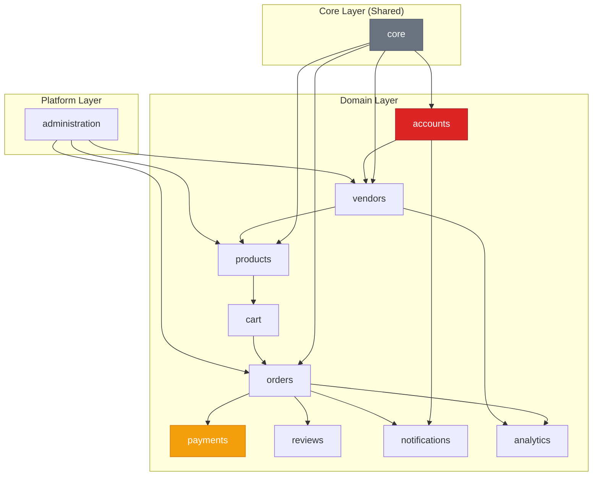

# VendorVerse — Django Architecture

> **Document Version:** 1.0  
> **Last Updated:** 2026-07-22  
> **Status:** Approved  
> **Related Documents:** [System Architecture](./03-system-architecture.md) · [Database Design](./04-database-design.md) · [Project Structure](./11-project-structure.md) · [Coding Standards](./12-coding-standards.md)

---

## 1. Django Project Organization

### 1.1 App Decomposition Strategy

Each Django app represents a **bounded domain context** with clear responsibilities and minimal cross-app coupling. Apps communicate through the service layer, not by importing each other's models directly (except for ForeignKey relations).



### 1.2 App Registry

| App | Label | Responsibilities | Key Models |
|---|---|---|---|
| `core` | Core | Base models, utilities, mixins, template tags, shared exceptions | TimeStampedModel, PublicIDModel |
| `accounts` | Accounts | User registration, authentication, profiles, addresses | User, UserProfile, Address, AuditLog |
| `vendors` | Vendors | Vendor applications, storefronts, subscriptions, earnings | Vendor, VendorApplication, Storefront, SubscriptionTier |
| `products` | Products | Product CRUD, categories, variants, images, tags | Product, Category, ProductImage, ProductVariant |
| `cart` | Cart | Shopping cart management, validation | Cart, CartItem |
| `orders` | Orders | Order lifecycle, tracking, returns, invoices | Order, OrderItem, OrderStatusLog, ReturnRequest |
| `payments` | Payments | Stripe integration, transactions, refunds, payouts | Payment, Transaction |
| `reviews` | Reviews | Product reviews, ratings, moderation, vendor responses | Review, ReviewImage, ReviewResponse |
| `notifications` | Notifications | In-app + email notifications, preferences | Notification, NotificationPreference |
| `analytics` | Analytics | Dashboard data, reports, aggregations | No models (uses aggregation queries) |
| `administration` | Administration | Site config, commission tiers, moderation queues, coupons | SiteConfiguration, Coupon, CouponUsage |

---

## 2. App Internal Structure

Every Django app follows a consistent internal structure:

```
apps/{app_name}/
├── __init__.py
├── apps.py                  # AppConfig with signals import
├── admin.py                 # Django admin registration
├── models/                  # Models (split for large apps)
│   ├── __init__.py          # Exports all models
│   └── {model}.py           # Individual model files
├── services.py              # Business logic (service layer)
├── selectors.py             # Read-only query logic (complex queries)
├── serializers.py           # DRF serializers
├── views/                   # Views (split by interface)
│   ├── __init__.py
│   ├── web.py               # Django template views (browser)
│   └── api.py               # DRF API views
├── urls/                    # URL configuration
│   ├── __init__.py
│   └── web.py               # Browser URL patterns
│   └── api.py               # API URL patterns
├── forms.py                 # Django forms (for template views)
├── filters.py               # django-filter FilterSets
├── permissions.py           # Custom DRF permissions
├── signals.py               # Signal definitions
├── receivers.py             # Signal receivers
├── tasks.py                 # Celery async tasks
├── exceptions.py            # App-specific exceptions
├── constants.py             # App constants and choices
├── validators.py            # Custom validators
├── managers.py              # Custom model managers / querysets
├── tests/                   # Tests
│   ├── __init__.py
│   ├── test_models.py
│   ├── test_services.py
│   ├── test_views.py
│   ├── test_api.py
│   └── factories.py         # Factory Boy test factories
├── templates/               # App-specific templates
│   └── {app_name}/
│       ├── {template}.html
│       └── partials/        # HTMX partial templates
│           └── {partial}.html
└── migrations/
    └── __init__.py
```

### 2.1 Service Layer Pattern

**Why a service layer?** Without it, business logic scatters across views, serializers, model methods, and signals. This makes logic untestable without HTTP, impossible to reuse between template views and API views, and hard to reason about.

```python
# apps/orders/services.py — Example pattern (NOT application code)

# Service functions are the ONLY place business logic lives.
# Views and serializers call services. Services call models/managers.

# def place_order(*, customer, cart, shipping_address_id, coupon_code=None):
#     """
#     Orchestrates the complete order placement flow.
#     Called by both the web view and the API view.
#     
#     Returns: Order instance
#     Raises: InsufficientStockError, InvalidCouponError, PaymentFailedError
#     """
#     pass
```

**Conventions:**
- Service functions use **keyword-only arguments** (`*` separator) for clarity
- Services raise **domain exceptions** (defined in `exceptions.py`), never HTTP exceptions
- Services are **stateless functions**, not classes (unless managing complex state)
- **Read-heavy queries** go in `selectors.py` (separation from write operations)
- Services are the **transaction boundary** — `@transaction.atomic` is applied here, not in views

### 2.2 Selectors Pattern

Selectors are read-only query functions that encapsulate complex queries, joins, and aggregations. They're separated from services to make it clear which functions mutate state and which are read-only.

```python
# apps/products/selectors.py — Example pattern

# def get_products_for_listing(*, category_slug=None, search_query=None,
#                               price_min=None, price_max=None,
#                               sort_by='relevance', page=1):
#     """
#     Returns paginated, filtered product queryset for the listing page.
#     Applies select_related and prefetch_related for optimal queries.
#     """
#     pass
```

---

## 3. Settings Architecture

### 3.1 Split Settings Pattern

Settings are split across environment-specific files to avoid `if DEBUG` conditionals:

```
config/
├── settings/
│   ├── __init__.py          # Empty (avoids import confusion)
│   ├── base.py              # Shared settings across all environments
│   ├── development.py       # Development overrides
│   ├── staging.py           # Staging overrides
│   ├── production.py        # Production overrides
│   └── test.py              # Test environment overrides
├── urls.py                  # Root URL configuration
├── wsgi.py                  # WSGI entry point
├── asgi.py                  # ASGI entry point
└── celery.py                # Celery configuration
```

### 3.2 Environment Variable Strategy

All sensitive/environment-specific values loaded from environment variables via `django-environ`:

| Category | Variables | Source |
|---|---|---|
| **Core** | `SECRET_KEY`, `DEBUG`, `ALLOWED_HOSTS` | `.env` file / deployment secrets |
| **Database** | `DATABASE_URL` | `.env` file / deployment secrets |
| **Redis** | `REDIS_URL` | `.env` file / deployment secrets |
| **Stripe** | `STRIPE_PUBLIC_KEY`, `STRIPE_SECRET_KEY`, `STRIPE_WEBHOOK_SECRET` | Deployment secrets only |
| **Email** | `EMAIL_HOST`, `EMAIL_PORT`, `EMAIL_HOST_USER`, `EMAIL_HOST_PASSWORD` | `.env` file / deployment secrets |
| **Storage** | `AWS_ACCESS_KEY_ID`, `AWS_SECRET_ACCESS_KEY`, `AWS_STORAGE_BUCKET_NAME` | Deployment secrets only |
| **Social Auth** | `GOOGLE_CLIENT_ID`, `GOOGLE_CLIENT_SECRET`, `GITHUB_CLIENT_ID`, `GITHUB_CLIENT_SECRET` | Deployment secrets only |

### 3.3 Key Settings Decisions

| Setting | Development | Production | Rationale |
|---|---|---|---|
| `DEBUG` | `True` | `False` | Never expose debug info in production |
| `DATABASES` | PostgreSQL (Docker) | PostgreSQL (managed) | Same engine across environments |
| `CACHES` | Redis (Docker) | Redis (managed/cluster) | Same backend, different endpoint |
| `EMAIL_BACKEND` | Console / Mailpit | SMTP / SendGrid | No real emails in dev |
| `DEFAULT_FILE_STORAGE` | Local filesystem | S3-compatible | No cloud dependency in dev |
| `STATICFILES_STORAGE` | Default | WhiteNoise / CDN | Static file optimization |
| `SESSION_ENGINE` | `cache` (Redis) | `cache` (Redis) | Consistent across envs |
| `SECURE_SSL_REDIRECT` | `False` | `True` | No SSL in local dev |
| `CSRF_COOKIE_SECURE` | `False` | `True` | Requires HTTPS |

---

## 4. Middleware Stack

Middleware is ordered carefully — each layer depends on processing from layers above it.

| Order | Middleware | Purpose |
|---|---|---|
| 1 | `SecurityMiddleware` | HTTPS redirect, security headers |
| 2 | `WhiteNoiseMiddleware` | Static file serving (production) |
| 3 | `CorsMiddleware` | CORS headers for API (if needed) |
| 4 | `SessionMiddleware` | Session handling (Redis-backed) |
| 5 | `CommonMiddleware` | URL normalization, Content-Length |
| 6 | `CsrfViewMiddleware` | CSRF protection |
| 7 | `AuthenticationMiddleware` | Attach user to request |
| 8 | `MessageMiddleware` | Django messages framework |
| 9 | `HtmxMiddleware` | HTMX request detection (`django-htmx`) |
| 10 | `RequestIDMiddleware` | Attach unique request ID for logging (custom) |
| 11 | `TimezoneMiddleware` | Set user timezone (custom) |

### 4.1 Custom Middleware

#### `RequestIDMiddleware`
Generates a unique `request_id` (UUID) for each request, attaches it to `request` object, and adds it to the response headers. Used for log correlation across the request lifecycle.

#### `TimezoneMiddleware`
Activates the user's timezone from their profile preferences. Falls back to `settings.TIME_ZONE`.

---

## 5. URL Configuration

### 5.1 Root URL Structure

```python
# config/urls.py — Structure (not code)

# ""                    → Homepage (products app)
# "products/"           → Product browsing/detail (products app)
# "categories/"         → Category browsing (products app)
# "search/"             → Search (products app)
# "cart/"               → Shopping cart (cart app)
# "checkout/"           → Checkout flow (orders app)
# "orders/"             → Order history/detail (orders app)
# "account/"            → Profile, addresses, wishlist (accounts app)
# "vendor/dashboard/"   → Vendor dashboard (vendors app)
# "vendor/products/"    → Vendor product management (vendors app)
# "vendor/orders/"      → Vendor order management (vendors app)
# "store/{slug}/"       → Public vendor storefront (vendors app)
# "admin/"              → Django admin (built-in)
# "manage/"             → Custom admin panel (administration app)
# "api/v1/"             → API endpoints (all apps)
# "api/v1/schema/"      → OpenAPI schema
# "api/v1/docs/"        → Swagger UI
```

### 5.2 URL Naming Convention

Pattern: `{app}:{action}` or `{app}:{entity}-{action}`

| Example | URL | Name |
|---|---|---|
| Product list | `/products/` | `products:list` |
| Product detail | `/products/{slug}/` | `products:detail` |
| Cart view | `/cart/` | `cart:detail` |
| Vendor dashboard | `/vendor/dashboard/` | `vendors:dashboard` |
| API product list | `/api/v1/products/` | `api:products:list` |

---

## 6. Template Architecture

### 6.1 Template Hierarchy

```
templates/
├── base.html                        # Root template (HTML head, body, scripts)
├── layouts/
│   ├── main.html                    # Main layout (nav, footer, sidebar)
│   ├── vendor_dashboard.html        # Vendor dashboard layout
│   ├── admin_panel.html             # Admin panel layout
│   └── auth.html                    # Auth pages layout (minimal)
├── includes/
│   ├── _navbar.html                 # Global navigation
│   ├── _footer.html                 # Global footer
│   ├── _messages.html               # Flash messages
│   ├── _pagination.html             # Pagination controls
│   ├── _breadcrumbs.html            # Breadcrumb navigation
│   ├── _search_bar.html             # Search component
│   └── _notification_bell.html      # Notification icon
├── components/
│   ├── _product_card.html           # Product card (used in lists)
│   ├── _vendor_card.html            # Vendor card
│   ├── _review_card.html            # Review display
│   ├── _star_rating.html            # Star rating display
│   ├── _price_display.html          # Price with sale formatting
│   ├── _cart_item.html              # Cart item row
│   ├── _order_status_badge.html     # Order status colored badge
│   ├── _modal.html                  # Reusable modal shell
│   └── _empty_state.html            # Empty state illustration
├── errors/
│   ├── 400.html
│   ├── 403.html
│   ├── 404.html
│   └── 500.html
└── emails/                          # Email templates
    ├── base_email.html              # Email base layout
    ├── order_confirmation.html
    ├── vendor_approved.html
    ├── password_reset.html
    └── ...
```

### 6.2 Template Naming Conventions

| Convention | Example | Purpose |
|---|---|---|
| `_prefix.html` | `_navbar.html` | Partial/include (never rendered directly) |
| `{entity}_list.html` | `product_list.html` | List view template |
| `{entity}_detail.html` | `product_detail.html` | Detail view template |
| `{entity}_form.html` | `product_form.html` | Create/edit form |
| `partials/{action}.html` | `partials/product_list_items.html` | HTMX swap targets |

### 6.3 HTMX Integration Pattern

```
<!-- Standard pattern for HTMX partial loading -->

<!-- Full page template: product_list.html -->
<!-- Contains the shell with header, sidebar, pagination -->
<!-- Includes the partial via  on initial load -->

<!-- Partial template: partials/product_list_items.html -->
<!-- Contains ONLY the product grid/list items -->
<!-- Returned directly when HX-Request header is present -->

<!-- View detects HTMX via django-htmx middleware -->
<!-- Returns partial template for HTMX requests -->
<!-- Returns full template for normal requests -->
```

---

## 7. Signal Architecture

### 7.1 Signal Usage Policy

Signals are used for **cross-cutting side effects** that should not tightly couple modules. They are NOT used for core business logic.

| ✅ Use Signals For | ❌ Don't Use Signals For |
|---|---|
| Sending notifications when order status changes | Calculating order totals |
| Invalidating cache on model save | Validating business rules |
| Logging audit events | Complex multi-step workflows |
| Updating denormalized counts | Anything where failure should rollback the transaction |

### 7.2 Signal Registry

| Signal | Sender | Receiver | Purpose |
|---|---|---|---|
| `post_save` | `Order` | `notifications.receivers` | Send order confirmation email |
| `post_save` | `OrderItem` (status change) | `notifications.receivers` | Notify customer of shipping/delivery |
| `post_save` | `VendorApplication` (approved) | `notifications.receivers` | Send vendor approval email |
| `post_save` | `Review` | `products.receivers` | Update product average_rating and review_count |
| `post_save` | `Product` | `core.receivers` | Invalidate product/category cache |
| `post_save` | `Order` (placed) | `analytics.receivers` | Update vendor sales metrics |
| `post_save` | `User` | `accounts.receivers` | Create UserProfile |
| Custom: `order_placed` | `orders.services` | `payments.receivers` | Initiate payment processing |
| Custom: `payment_completed` | `payments.services` | `orders.receivers` | Update order status to 'Placed' |
| Custom: `stock_low` | `products.services` | `notifications.receivers` | Send low stock alert to vendor |

### 7.3 Signal Implementation Rules

1. Signals are **defined** in `signals.py` and **received** in `receivers.py`
2. Receivers are connected in `apps.py` → `ready()` method
3. Receivers must be **idempotent** — safe to execute multiple times
4. Receivers must be **fast** — offload heavy work to Celery tasks
5. Receiver failures must NOT rollback the triggering transaction (use `try/except`)
6. All custom signals include `request_id` for log correlation

---

## 8. Management Commands

| Command | App | Purpose |
|---|---|---|
| `seed_data` | `core` | Populate database with initial/demo data |
| `create_superadmin` | `accounts` | Create platform admin account with proper role |
| `update_search_vectors` | `products` | Rebuild PostgreSQL search vectors for all products |
| `cleanup_expired_carts` | `cart` | Remove anonymous carts older than 30 days |
| `process_payouts` | `payments` | Process pending vendor payouts via Stripe |
| `generate_daily_report` | `analytics` | Generate daily platform analytics report |
| `recalculate_ratings` | `reviews` | Rebuild denormalized rating/review counts |

---

## 9. Static Files & Assets Strategy

### 9.1 Static File Organization

```
static/
├── css/
│   ├── output.css               # Tailwind compiled output
│   └── custom.css               # Custom CSS overrides
├── js/
│   ├── htmx.min.js              # HTMX library
│   ├── alpine.min.js            # Alpine.js library
│   ├── app.js                   # Custom JavaScript
│   └── components/
│       ├── cart.js               # Cart interaction logic
│       ├── search.js             # Search autocomplete
│       └── notifications.js     # Notification polling
├── images/
│   ├── logo.svg                 # Platform logo
│   ├── favicon.ico
│   └── placeholders/            # Default images
├── fonts/                        # Self-hosted fonts (if any)
└── vendor/                       # Third-party assets
```

### 9.2 Asset Pipeline

| Environment | Strategy |
|---|---|
| **Development** | Django's `staticfiles` app; Tailwind JIT watcher; files served by Django |
| **Production** | `collectstatic` → WhiteNoise serves with compression + caching headers; CDN for media files |

### 9.3 Media File Handling

| Concern | Strategy |
|---|---|
| **Upload** | File type whitelist (JPEG, PNG, WebP, GIF); max 5MB; validated in form/serializer |
| **Processing** | Celery task: resize, compress, convert to WebP, generate thumbnails |
| **Storage (dev)** | Local filesystem (`MEDIA_ROOT`) |
| **Storage (prod)** | S3-compatible via `django-storages` |
| **Serving** | Signed URLs with expiry; CDN caching |

---

## 10. Third-Party Package Registry

| Package | Version | Purpose | Required |
|---|---|---|---|
| `djangorestframework` | 3.15+ | REST API framework | Yes |
| `django-allauth` | 0.63+ | Authentication + social auth | Yes |
| `djangorestframework-simplejwt` | 5.3+ | JWT authentication for API | Yes |
| `django-htmx` | 1.19+ | HTMX middleware and utilities | Yes |
| `django-filter` | 24.3+ | API/view queryset filtering | Yes |
| `drf-spectacular` | 0.27+ | OpenAPI schema generation | Yes |
| `django-environ` | 0.11+ | Environment variable management | Yes |
| `django-storages` | 1.14+ | S3-compatible file storage | Yes |
| `django-redis` | 5.4+ | Redis cache backend | Yes |
| `celery` | 5.4+ | Async task queue | Yes |
| `django-celery-beat` | 2.6+ | Periodic task scheduling | Yes |
| `Pillow` | 10+ | Image processing | Yes |
| `stripe` | 10+ | Stripe API client | Yes |
| `whitenoise` | 6.7+ | Static file serving | Yes |
| `gunicorn` | 22+ | Production WSGI server | Yes |
| `sentry-sdk` | 2+ | Error tracking | Yes |
| `django-cors-headers` | 4.4+ | CORS handling | Yes |
| `django-debug-toolbar` | 4.4+ | Development debugging | Dev only |
| `factory-boy` | 3.3+ | Test data factories | Dev only |
| `pytest-django` | 4.8+ | Testing framework | Dev only |
| `ruff` | 0.5+ | Linting + formatting | Dev only |
| `pre-commit` | 3.7+ | Git hook management | Dev only |
| `coverage` | 7+ | Test coverage reporting | Dev only |

---

*← [API Design](./05-api-design.md) · Next: [UI/UX Design →](./07-ui-ux-design.md)*
