# VendorVerse — User Flows & Use Cases

> **Document Version:** 1.0  
> **Last Updated:** 2026-07-22  
> **Status:** Approved  
> **Related Documents:** [Software Requirements](./02-software-requirements.md) · [UI/UX Design](./07-ui-ux-design.md) · [Authentication & Authorization](./09-authentication-authorization.md)

---

## 1. Use Case Overview

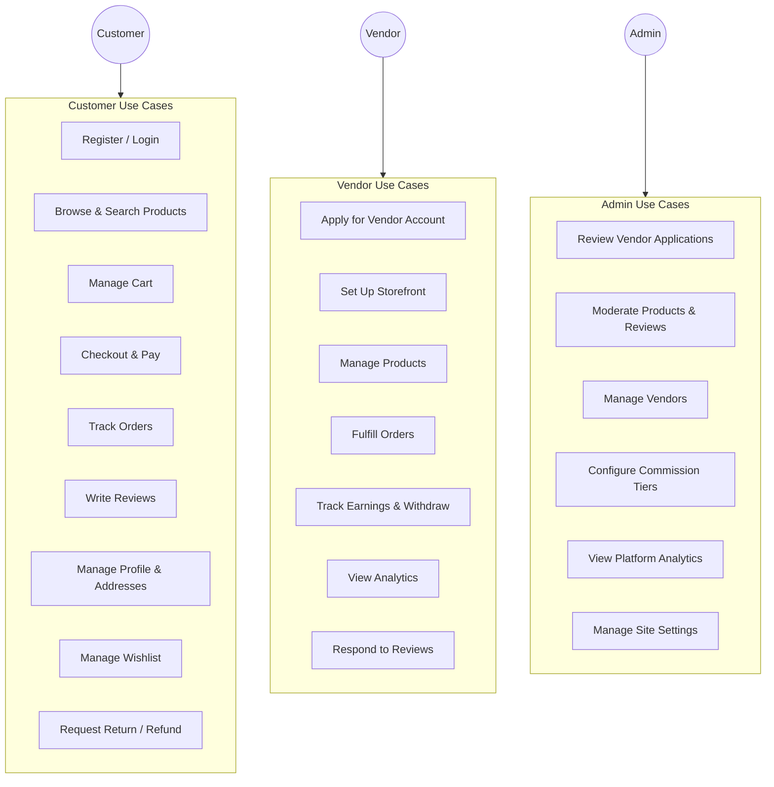

---

## 2. Customer Flows

### 2.1 Registration Flow

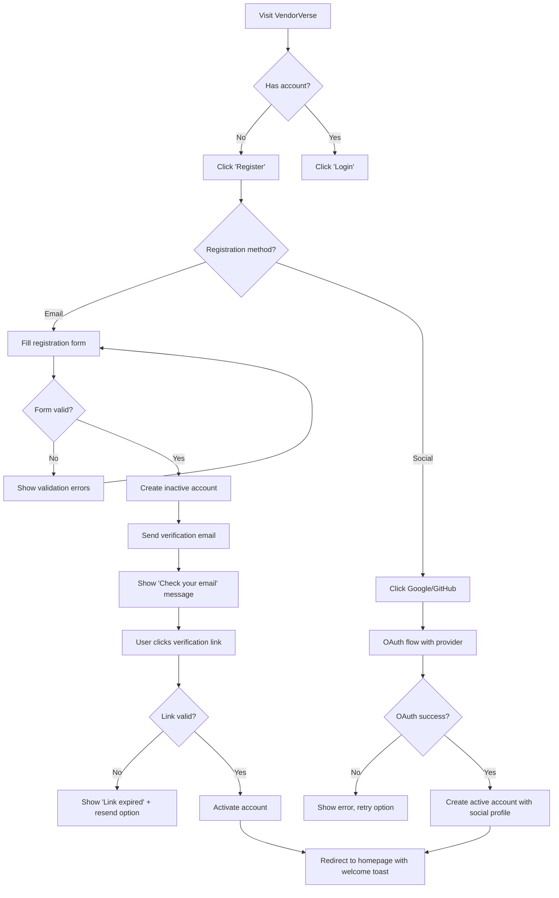

### 2.2 Product Discovery Flow

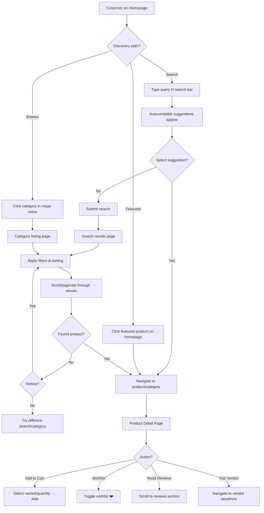

### 2.3 Checkout Flow (Critical Path)

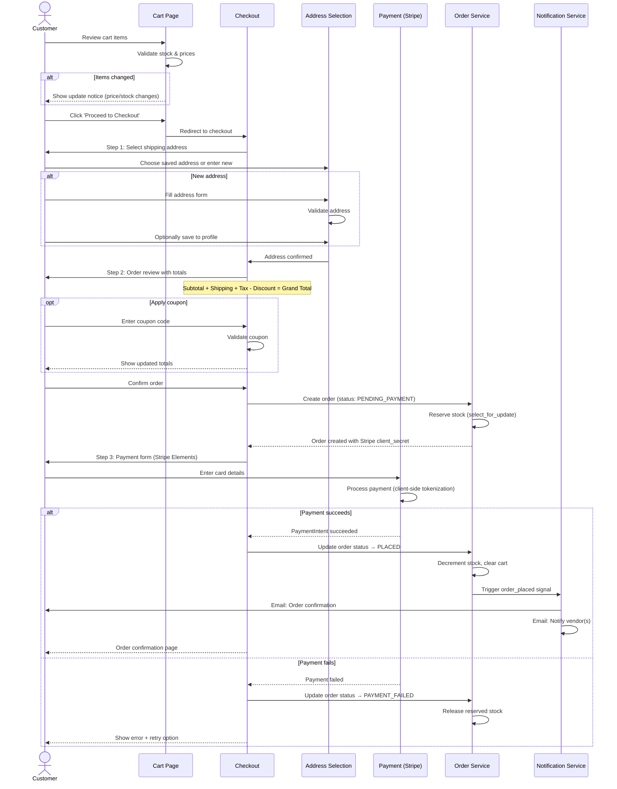

### 2.4 Order Tracking Flow

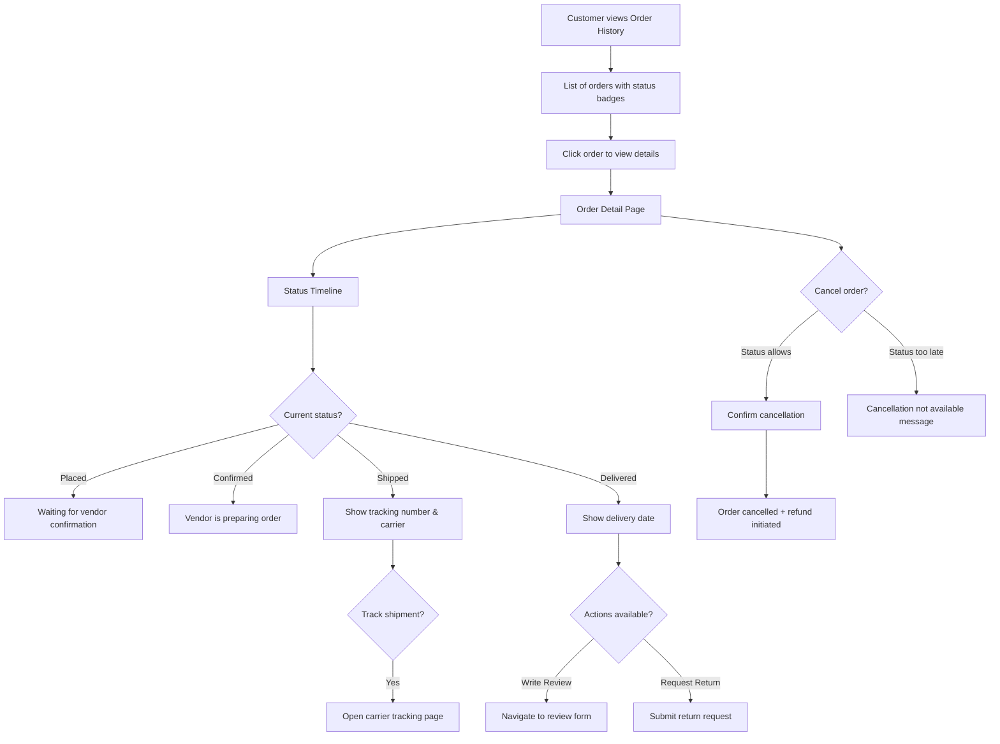

---

## 3. Vendor Flows

### 3.1 Vendor Application & Onboarding

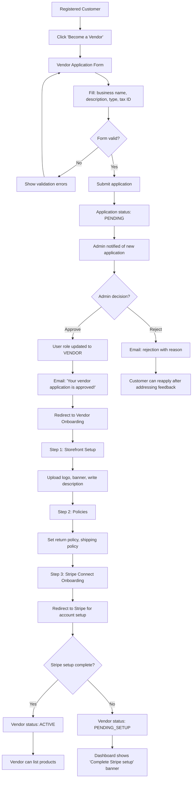

### 3.2 Product Management Flow

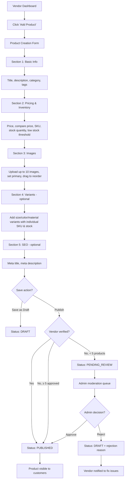

### 3.3 Order Fulfillment Flow

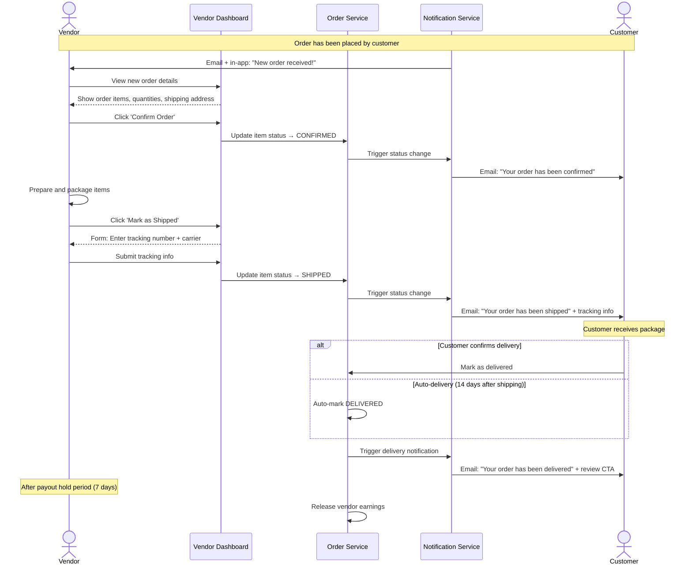

---

## 4. Admin Flows

### 4.1 Vendor Application Review

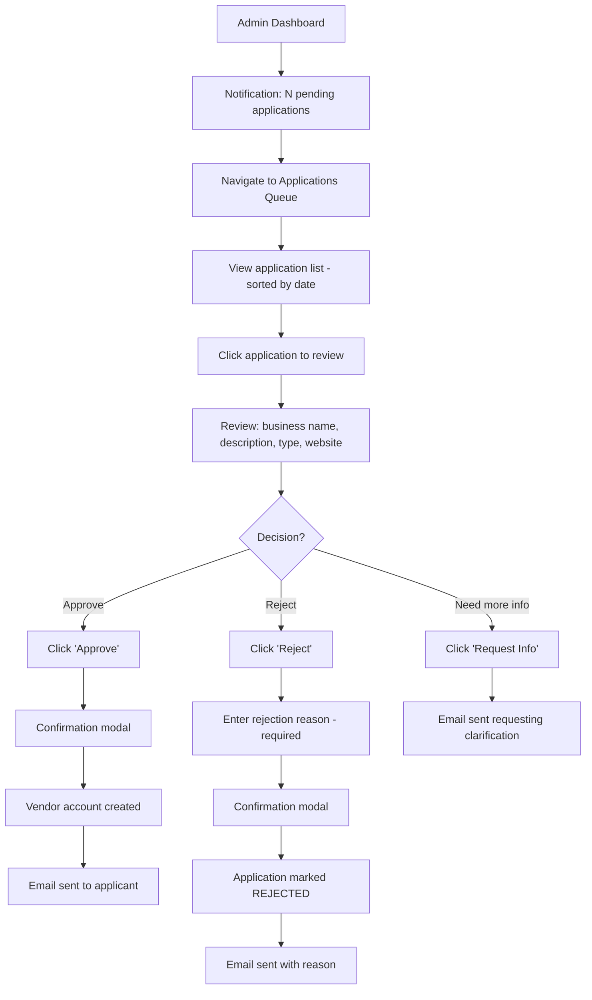

### 4.2 Content Moderation Flow

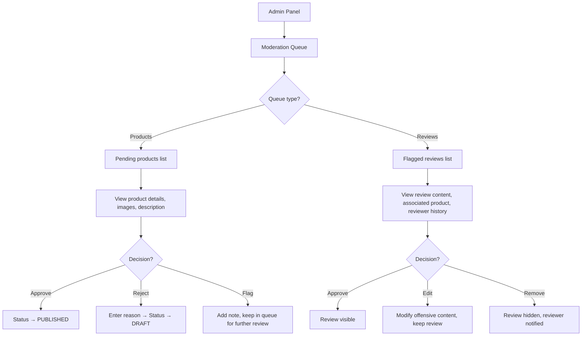

---

## 5. Sequence Diagrams — Critical System Interactions

### 5.1 Multi-Vendor Cart to Sub-Orders

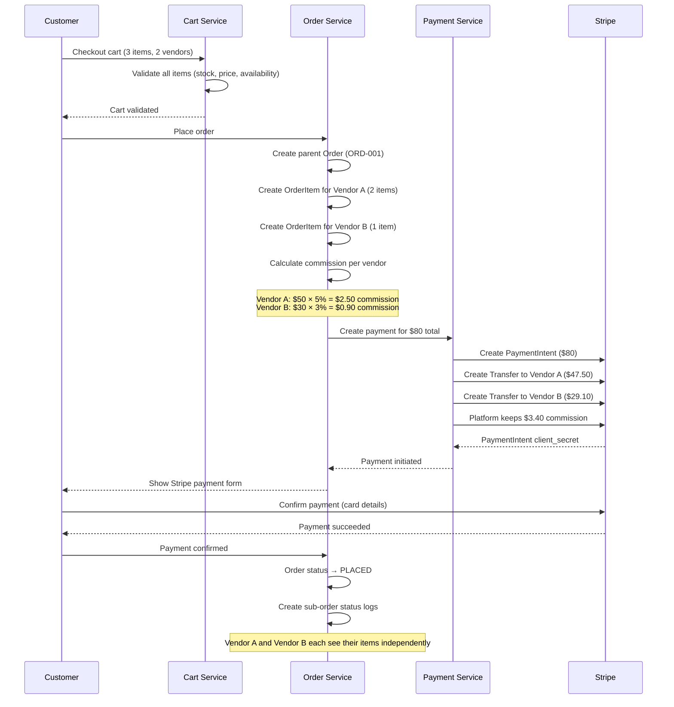

### 5.2 Review Submission Flow

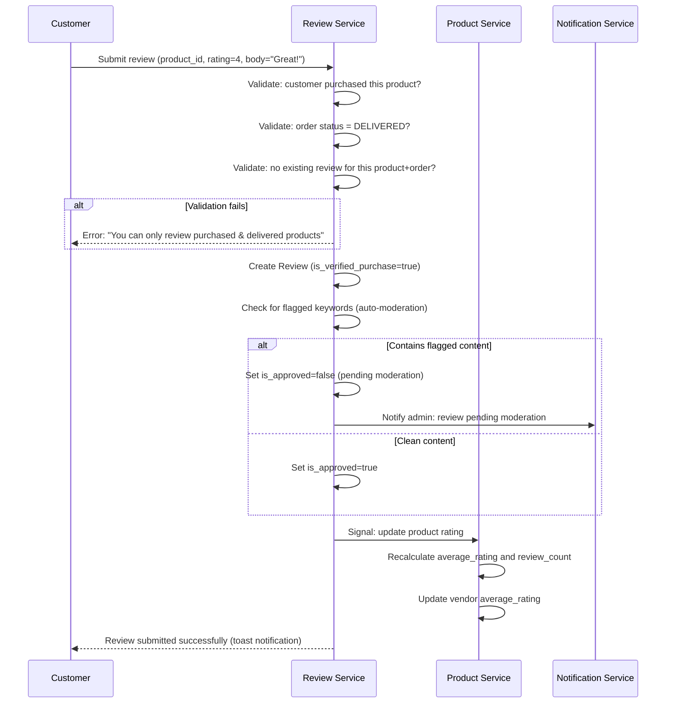

### 5.3 Vendor Payout Flow

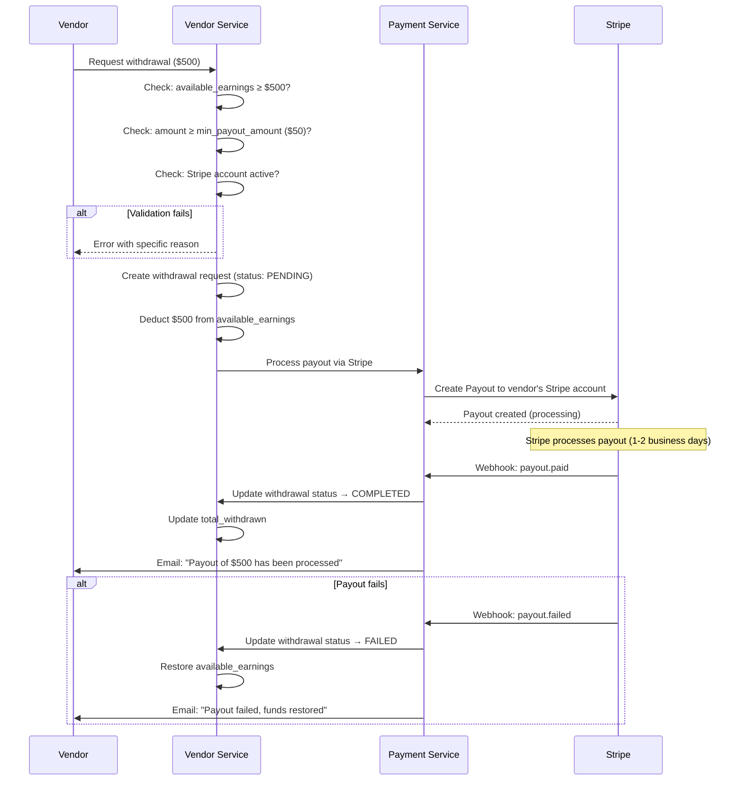

---

## 6. Error Scenarios & Edge Cases

### 6.1 Cart Edge Cases

| Scenario | System Behavior | User Experience |
|---|---|---|
| Product goes out of stock after being added to cart | Cart validation at checkout detects | Warning: "X is no longer available" with option to remove |
| Product price changes after being added to cart | Cart validation at checkout detects | Notice: "Price of X has changed from $Y to $Z" with updated totals |
| Vendor gets suspended with products in carts | Cart validation removes vendor items | Warning: "Items from X are no longer available" |
| Cart item quantity exceeds available stock | Reduce to max available | Notice: "Only N units of X available" |
| Coupon expires during checkout | Validate at order creation | Error: "Coupon has expired" with updated totals |

### 6.2 Order Edge Cases

| Scenario | System Behavior | User Experience |
|---|---|---|
| Vendor doesn't confirm order in 48 hours | Celery task sends reminder at 24h; escalate to admin at 48h | Customer receives "delay" notification |
| Customer cancels multi-vendor order | Per-vendor items cancelled independently | Only cancellable items cancelled; shipped items excluded |
| Partial delivery (some items from order) | Each order item tracked independently | Order status: PARTIALLY_SHIPPED; item-level tracking |
| Double payment attempt | Idempotency key on PaymentIntent | Second attempt detected; single charge processed |
| Stripe webhook arrives before client callback | Order updated via webhook; client sees updated state | No inconsistency — webhook is source of truth |

---

*← [UI/UX Design](./07-ui-ux-design.md) · Next: [Authentication & Authorization →](./09-authentication-authorization.md)*
