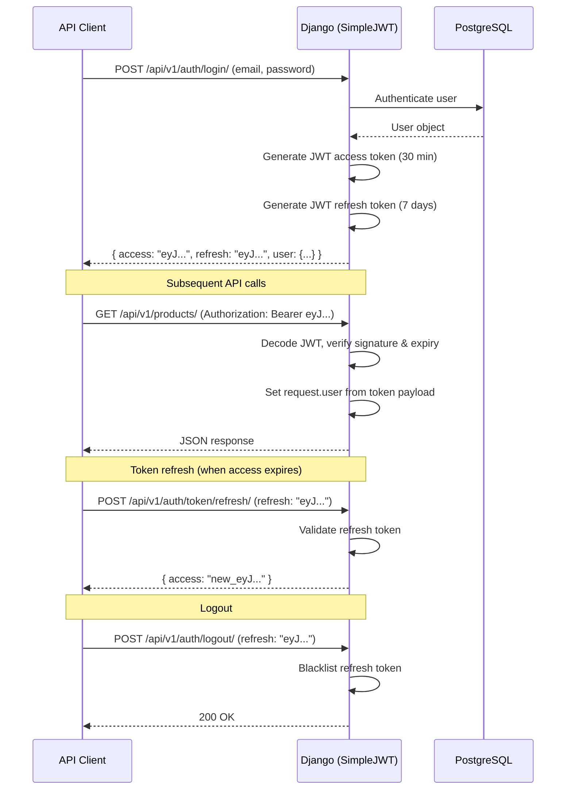
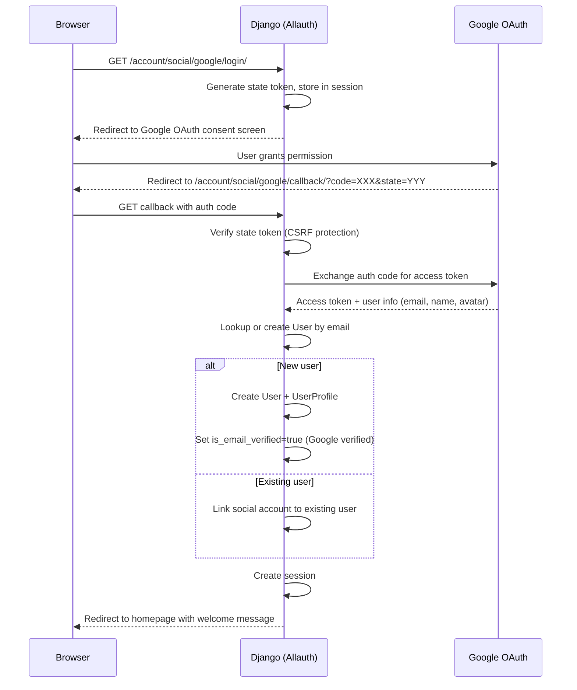
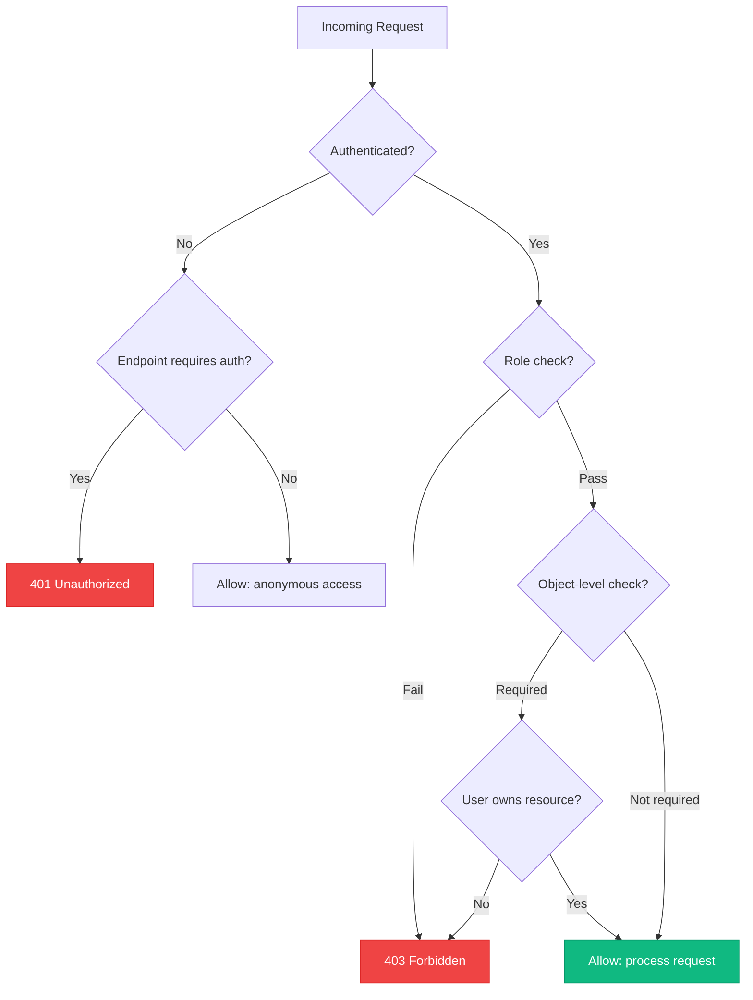
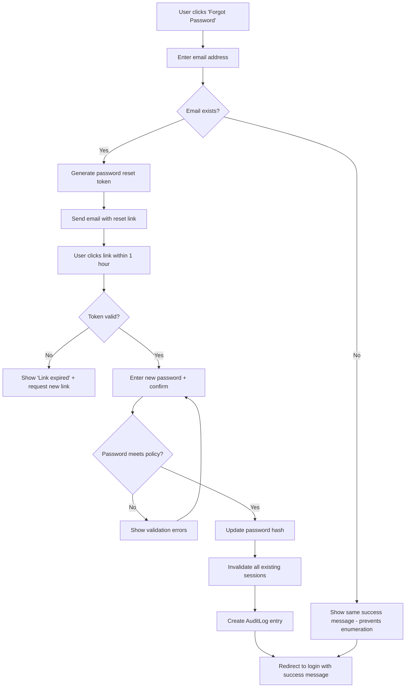
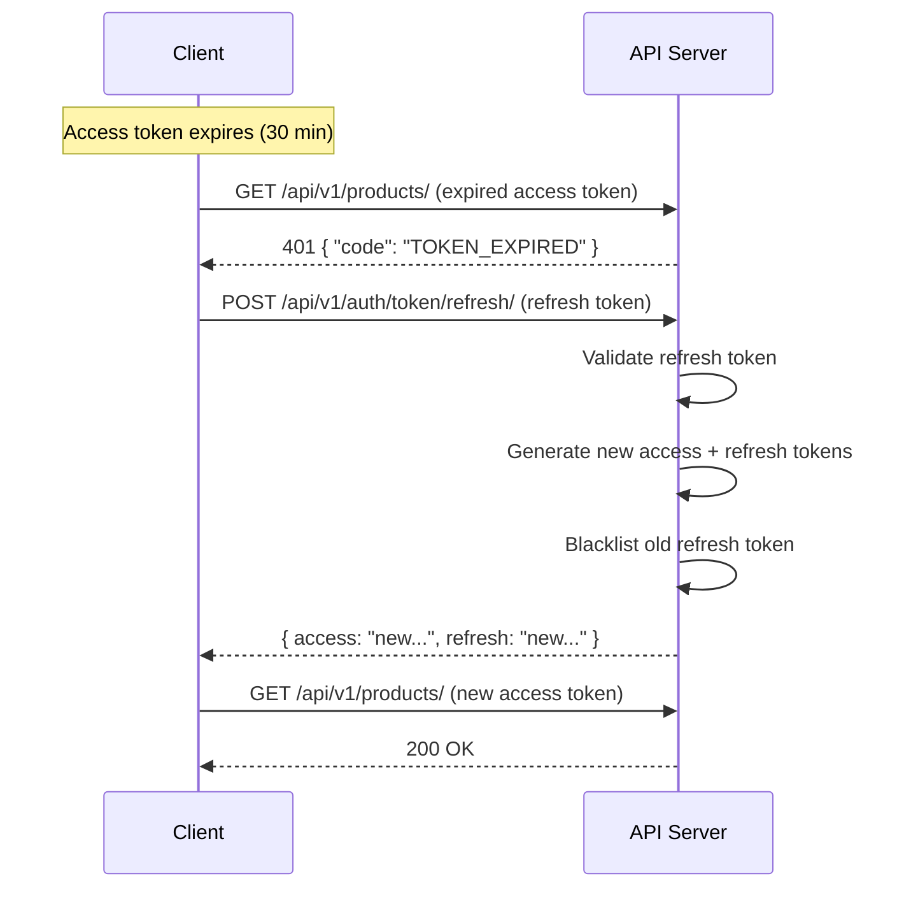

# VendorVerse — Authentication & Authorization

> **Document Version:** 1.0  
> **Last Updated:** 2026-07-22  
> **Status:** Approved  
> **Related Documents:** [Software Requirements](./02-software-requirements.md) · [System Architecture](./03-system-architecture.md) · [API Design](./05-api-design.md) · [Security & Performance](./10-security-performance.md)

---

## 1. Authentication Strategy

### 1.1 Dual Authentication Model

VendorVerse employs two authentication mechanisms for two different interfaces:

| Interface | Mechanism | Library | Token Storage | Lifetime |
|---|---|---|---|---|
| **Browser (Django Views)** | Session-based auth | Django Allauth | HttpOnly cookie + Redis server-side | Session: 2 weeks (sliding) |
| **API (DRF)** | JWT token auth | SimpleJWT | Client-managed (localStorage / mobile keychain) | Access: 30 min, Refresh: 7 days |

**Why two mechanisms?**
- Sessions are the gold standard for browser security (HttpOnly, SameSite, CSRF-protected)
- JWTs are necessary for stateless API authentication (mobile apps, third-party integrations)
- Django Allauth handles the complex auth flows (registration, verification, social auth, password reset) for both

### 1.2 Authentication Flow — Browser

```mermaid
sequenceDiagram
    participant B as Browser
    participant DJ as Django (Allauth)
    participant RD as Redis (Session Store)
    participant DB as PostgreSQL

    B->>DJ: POST /account/login/ (email, password, CSRF token)
    DJ->>DB: Authenticate user (check credentials)

    alt Credentials valid
        DB-->>DJ: User object
        DJ->>DJ: Check: is_active? is_email_verified?
        DJ->>RD: Create session (user_id, role, login_time)
        RD-->>DJ: Session key
        DJ-->>B: Set-Cookie: sessionid=<key>; HttpOnly; Secure; SameSite=Lax
        DJ-->>B: Redirect to next URL or homepage
    else Credentials invalid
        DJ->>DJ: Increment failed_attempts counter
        alt 5+ failed attempts
            DJ->>DB: Create AuditLog (FAILED_LOGIN, IP)
            DJ-->>B: "Account temporarily locked. Try again in 15 minutes."
        else Under threshold
            DJ-->>B: "Invalid email or password."
        end
    end

    Note over B, DJ: Subsequent requests
    B->>DJ: GET /products/ (Cookie: sessionid=<key>)
    DJ->>RD: Lookup session by key
    RD-->>DJ: Session data (user_id, role)
    DJ->>DJ: AuthenticationMiddleware sets request.user
    DJ-->>B: Rendered page
```

### 1.3 Authentication Flow — API (JWT)



### 1.4 Social Authentication Flow



---

## 2. Authorization Model

### 2.1 Role-Based Access Control (RBAC)

VendorVerse uses a simple but effective role model. Users have a single `role` field rather than a many-to-many group system, because the three roles are mutually exclusive in their workflows.

| Role | Value | Description | Granted On |
|---|---|---|---|
| **Customer** | `CUSTOMER` | Default role for all registered users | Registration |
| **Vendor** | `VENDOR` | Users approved as vendors | Admin approves vendor application |
| **Admin** | `ADMIN` | Platform administrators | Superuser creation via management command |

**Role Transition:** `CUSTOMER → VENDOR` is the only allowed transition. It's one-way — a vendor retains customer capabilities (shopping, reviews) plus vendor capabilities.

### 2.2 Permission Matrix

#### Resource-Level Permissions

| Resource / Action | Anonymous | Customer | Vendor | Admin |
|---|---|---|---|---|
| **Products** | | | | |
| View published products | ✅ | ✅ | ✅ | ✅ |
| Create product | ❌ | ❌ | ✅ own | ✅ any |
| Edit product | ❌ | ❌ | ✅ own | ✅ any |
| Delete/archive product | ❌ | ❌ | ✅ own | ✅ any |
| **Cart & Orders** | | | | |
| Add to cart | ❌ | ✅ | ✅ | ❌ |
| Place order | ❌ | ✅ | ✅ | ❌ |
| View order | ❌ | ✅ own | ✅ own items | ✅ any |
| Cancel order | ❌ | ✅ own (pre-ship) | ❌ | ✅ any |
| Update order item status | ❌ | ❌ | ✅ own items | ✅ any |
| **Vendor Management** | | | | |
| Apply for vendor | ❌ | ✅ | ❌ | ❌ |
| View vendor storefront | ✅ | ✅ | ✅ | ✅ |
| Edit storefront | ❌ | ❌ | ✅ own | ✅ any |
| View vendor dashboard | ❌ | ❌ | ✅ own | ✅ any |
| **Reviews** | | | | |
| Read reviews | ✅ | ✅ | ✅ | ✅ |
| Write review | ❌ | ✅ purchased | ✅ purchased | ❌ |
| Respond to review | ❌ | ❌ | ✅ own products | ❌ |
| Moderate reviews | ❌ | ❌ | ❌ | ✅ |
| **Admin Panel** | | | | |
| Access admin panel | ❌ | ❌ | ❌ | ✅ |
| Approve/reject vendors | ❌ | ❌ | ❌ | ✅ |
| Moderate content | ❌ | ❌ | ❌ | ✅ |
| Configure platform | ❌ | ❌ | ❌ | ✅ |
| View platform analytics | ❌ | ❌ | ❌ | ✅ |

### 2.3 Permission Implementation

#### Django View Permissions (Browser)

| Mechanism | Usage |
|---|---|
| `LoginRequiredMixin` | Require authentication |
| `UserPassesTestMixin` | Role-based checks (`user.role == 'VENDOR'`) |
| Custom mixins: `VendorRequiredMixin`, `AdminRequiredMixin` | Role enforcement with redirect to appropriate page |
| Object-level: `VendorOwnerMixin` | Verify vendor owns the resource (product, order item) |

#### DRF API Permissions

| Permission Class | Logic |
|---|---|
| `IsAuthenticated` | Standard DRF — user must be authenticated |
| `IsCustomer` | Custom — `user.role in ['CUSTOMER', 'VENDOR']` (vendors can also shop) |
| `IsVendor` | Custom — `user.role == 'VENDOR'` |
| `IsAdmin` | Custom — `user.role == 'ADMIN'` |
| `IsVendorOwner` | Custom — `user.vendor == obj.vendor` (object-level) |
| `IsOrderOwner` | Custom — `user == obj.customer` (object-level) |
| `IsReviewAuthor` | Custom — `user == obj.customer` (object-level) |
| `IsAdminOrVendorOwner` | Custom — admin OR vendor who owns the resource |

### 2.4 Permission Enforcement Architecture



---

## 3. Session Management

### 3.1 Session Configuration

| Setting | Value | Rationale |
|---|---|---|
| `SESSION_ENGINE` | `django.contrib.sessions.backends.cache` | Redis-backed for performance |
| `SESSION_CACHE_ALIAS` | `sessions` | Dedicated Redis database |
| `SESSION_COOKIE_AGE` | 1209600 (14 days) | Balance convenience and security |
| `SESSION_SAVE_EVERY_REQUEST` | `True` | Sliding expiration — active users stay logged in |
| `SESSION_COOKIE_HTTPONLY` | `True` | Prevent JavaScript access (XSS protection) |
| `SESSION_COOKIE_SECURE` | `True` (production) | Require HTTPS |
| `SESSION_COOKIE_SAMESITE` | `Lax` | CSRF protection; allow navigation from external links |
| `SESSION_COOKIE_NAME` | `vendorverse_session` | Avoid collision with other apps |

### 3.2 Session Data Structure

| Key | Type | Purpose |
|---|---|---|
| `_auth_user_id` | int | Authenticated user's PK |
| `_auth_user_hash` | str | Password hash (invalidate on password change) |
| `cart_id` | int | Associated cart (for anonymous → authenticated merge) |
| `timezone` | str | User's timezone preference |
| `_messages` | list | Django messages queue |

---

## 4. Password Policy

| Rule | Requirement | Implementation |
|---|---|---|
| Minimum length | 8 characters | Django `MinimumLengthValidator` |
| Complexity | Cannot be entirely numeric | Django `NumericPasswordValidator` |
| Common passwords | Not in 20,000 common passwords list | Django `CommonPasswordValidator` |
| Similarity | Not too similar to user attributes | Django `UserAttributeSimilarityValidator` |
| Hashing algorithm | Argon2id | `django.contrib.auth.hashers.Argon2PasswordHasher` (first in list) |
| Password history | Cannot reuse last 5 passwords | Custom validator checking `PasswordHistory` model |

### 4.1 Password Reset Flow



---

## 5. API Token Security

### 5.1 JWT Configuration

| Setting | Value | Rationale |
|---|---|---|
| `ACCESS_TOKEN_LIFETIME` | 30 minutes | Short-lived to limit damage from token theft |
| `REFRESH_TOKEN_LIFETIME` | 7 days | Convenience for persistent clients |
| `ROTATE_REFRESH_TOKENS` | `True` | New refresh token on each refresh (token rotation) |
| `BLACKLIST_AFTER_ROTATION` | `True` | Old refresh token invalidated after rotation |
| `ALGORITHM` | HS256 | HMAC-SHA256 (symmetric; sufficient for single-service) |
| `SIGNING_KEY` | `SECRET_KEY` | Django's secret key |
| `AUTH_HEADER_TYPES` | `('Bearer',)` | Standard Authorization header format |

### 5.2 JWT Payload

```json
{
  "token_type": "access",
  "exp": 1753200000,
  "iat": 1753198200,
  "jti": "unique-token-id",
  "user_id": 42,
  "role": "vendor",
  "email": "vendor@example.com"
}
```

Custom claims (`role`, `email`) added via custom `TokenObtainPairSerializer` to avoid database lookups on every request for role-based permission checks.

### 5.3 Token Refresh Strategy



---

## 6. Security Audit Logging

### 6.1 Audited Events

| Event | Logged Data | Alert |
|---|---|---|
| Successful login | User, IP, user_agent, timestamp | No |
| Failed login | Email attempted, IP, user_agent | Yes (after 5 failures) |
| Password change | User, IP, timestamp | Email notification to user |
| Password reset request | Email, IP, timestamp | No |
| Password reset complete | User, IP, timestamp | Email notification to user |
| Social account linked | User, provider, timestamp | No |
| Role change (customer → vendor) | User, changed_by, timestamp | No |
| Account deactivation | User, IP, timestamp | Email notification |
| Session created | User, IP, user_agent, session_key | No |
| Session destroyed | User, session_key, timestamp | No |
| Admin action (any) | Admin user, action, target, timestamp | Logged to separate admin audit |

### 6.2 Brute Force Protection

| Mechanism | Threshold | Action |
|---|---|---|
| Login rate limiting | 10 attempts / minute (per IP) | HTTP 429 response |
| Account lockout | 5 failed attempts | 15-minute lockout |
| Progressive delay | 3+ failures | Increasing delay before response |
| IP blocking | 50 failed attempts / hour | Temporary IP block (1 hour) |
| Alerting | 10+ accounts targeted from same IP | Admin notification |

---

## 7. CORS Configuration

| Setting | Development | Production |
|---|---|---|
| `CORS_ALLOW_ALL_ORIGINS` | `True` | `False` |
| `CORS_ALLOWED_ORIGINS` | — | `["https://vendorverse.com"]` |
| `CORS_ALLOW_CREDENTIALS` | `True` | `True` |
| `CORS_ALLOW_HEADERS` | Default + `X-Request-ID` | Default + `X-Request-ID` |

---

*← [User Flows](./08-user-flows.md) · Next: [Security & Performance →](./10-security-performance.md)*
