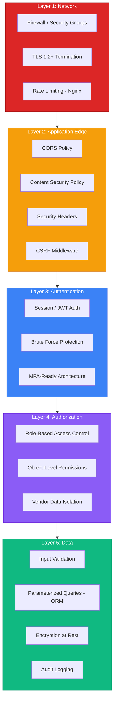
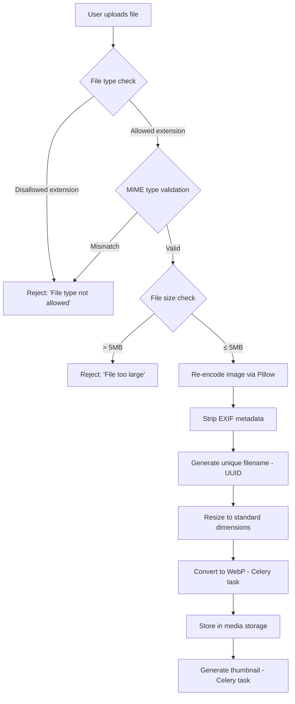
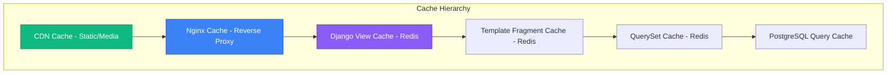
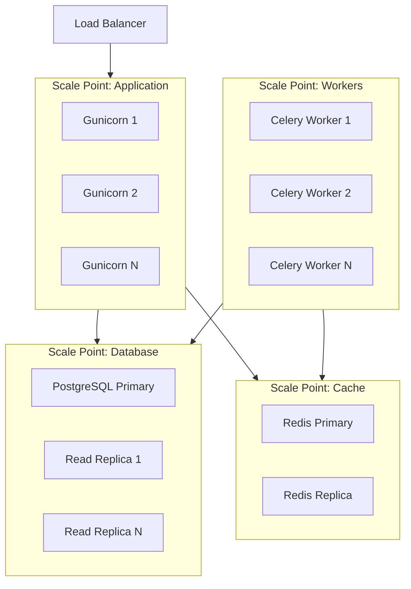

# VendorVerse — Security & Performance

> **Document Version:** 1.0  
> **Last Updated:** 2026-07-22  
> **Status:** Approved  
> **Related Documents:** [System Architecture](./03-system-architecture.md) · [Authentication & Authorization](./09-authentication-authorization.md) · [Deployment Guide](./14-deployment-guide.md)

---

## 1. Security Architecture

### 1.1 Defense-in-Depth Layers

---

## 2. OWASP Top 10 Mitigations

### A01:2021 — Broken Access Control

| Threat | Mitigation |
|---|---|
| Unauthorized access to vendor data | Object-level permissions (`IsVendorOwner`); all vendor queries filtered by `request.user.vendor` |
| Privilege escalation | Role check on every view/endpoint; role transitions only via admin-approved workflow |
| IDOR (Insecure Direct Object Reference) | Public UUIDs instead of integer PKs in URLs; ownership validation in service layer |
| Forced browsing to admin pages | `AdminRequiredMixin` / `IsAdmin` permission on all admin views |
| Missing function-level access control | Permission classes mandatory on all DRF views (`DEFAULT_PERMISSION_CLASSES = [IsAuthenticated]`) |

### A02:2021 — Cryptographic Failures

| Threat | Mitigation |
|---|---|
| Password storage | Argon2id hashing (not MD5/SHA); Django's `PASSWORD_HASHERS` configured with Argon2 first |
| Data in transit | TLS 1.2+ enforced; HSTS header with `max-age=31536000` |
| Sensitive data at rest | `django-encrypted-model-fields` for PII (phone, address); database-level encryption for backups |
| Secret key exposure | Environment variables, never committed to source; `.env` in `.gitignore`; secrets manager in production |
| JWT key management | `SECRET_KEY` rotated periodically; rotation invalidates all JWTs (planned disruption) |

### A03:2021 — Injection

| Threat | Mitigation |
|---|---|
| SQL injection | Django ORM (parameterized queries exclusively); no `raw()` or `extra()` usage; `RawSQL` banned in code review |
| Template injection | Django template auto-escaping enabled by default; `|safe` filter reviewed in every PR |
| Command injection | No `os.system()` or `subprocess` with user input; all file operations via Django storage API |
| LDAP / OS injection | Not applicable (no LDAP; no shell execution) |

### A04:2021 — Insecure Design

| Threat | Mitigation |
|---|---|
| Business logic flaws | Service layer encapsulates all business rules; comprehensive unit tests on services |
| Race conditions (stock) | `select_for_update()` on stock modification; database-level `CHECK (stock_quantity >= 0)` |
| Commission calculation errors | Immutable transaction logs; rate captured at order time; reconciliation job |

### A05:2021 — Security Misconfiguration

| Threat | Mitigation |
|---|---|
| Debug mode in production | `DEBUG = False` enforced via env var; CI check prevents deployment with `DEBUG=True` |
| Default credentials | No default admin password; created via management command with random password |
| Unnecessary features | Unused Django apps removed; Django admin restricted to staff |
| Stack trace exposure | Custom error templates (400, 403, 404, 500); DRF exception handler hides internals |
| Missing security headers | Middleware enforces all headers (see §3) |

### A06:2021 — Vulnerable Components

| Threat | Mitigation |
|---|---|
| Known vulnerabilities in dependencies | `pip-audit` / `safety` in CI pipeline; Dependabot/Renovate for automated updates |
| Outdated Django | Pin Django major version; update minor versions monthly |
| Supply chain attacks | Pin dependency versions in `requirements.txt`; hash verification |

### A07:2021 — Authentication Failures

| Threat | Mitigation |
|---|---|
| Credential stuffing | Rate limiting (10/min per IP on login); account lockout after 5 failures |
| Session fixation | Django regenerates session ID on login (`request.session.cycle_key()`) |
| Session hijacking | HttpOnly, Secure, SameSite cookies; session bound to user agent |
| JWT theft | Short access token lifetime (30 min); refresh token rotation + blacklisting |
| Password enumeration | Same response for valid/invalid emails on registration and password reset |

### A08:2021 — Software and Data Integrity

| Threat | Mitigation |
|---|---|
| Unsigned updates | Docker images built from pinned base; Dockerfile uses specific SHA digests |
| Deserialization attacks | Django's built-in serialization; no pickle; JSON-only API |
| CI/CD pipeline tampering | GitHub Actions with pinned action versions; required reviews |

### A09:2021 — Logging and Monitoring Failures

| Threat | Mitigation |
|---|---|
| Insufficient logging | Structured logging for all security events (see [System Architecture §13](./03-system-architecture.md)) |
| No alerting | Sentry for errors; alerts on brute force patterns; admin notifications for suspicious activity |
| Log injection | Sanitize user input in log messages; structured JSON logging prevents injection |

### A10:2021 — Server-Side Request Forgery (SSRF)

| Threat | Mitigation |
|---|---|
| SSRF via URL input | User URLs (vendor website) are displayed, never fetched server-side |
| SSRF via webhooks | Stripe webhooks validated with signature verification; no arbitrary URL callbacks |

---

## 3. Security Headers

| Header | Value | Purpose |
|---|---|---|
| `Strict-Transport-Security` | `max-age=31536000; includeSubDomains; preload` | Force HTTPS for 1 year |
| `Content-Security-Policy` | `default-src 'self'; script-src 'self' https://js.stripe.com; style-src 'self' 'unsafe-inline' https://fonts.googleapis.com; img-src 'self' data: https://*.s3.amazonaws.com; font-src 'self' https://fonts.gstatic.com; frame-src https://js.stripe.com; connect-src 'self' https://api.stripe.com` | Prevent XSS, clickjacking, data injection |
| `X-Content-Type-Options` | `nosniff` | Prevent MIME sniffing |
| `X-Frame-Options` | `DENY` | Prevent clickjacking |
| `Referrer-Policy` | `strict-origin-when-cross-origin` | Control referrer information leakage |
| `Permissions-Policy` | `camera=(), microphone=(), geolocation=()` | Disable unnecessary browser features |
| `X-XSS-Protection` | `0` | Disable legacy XSS filter (CSP is sufficient; legacy filter can cause issues) |

---

## 4. File Upload Security

| Control | Implementation |
|---|---|
| **Allowed types** | `.jpg`, `.jpeg`, `.png`, `.webp`, `.gif` (images only for MVP) |
| **MIME validation** | `python-magic` library checks actual file content, not just extension |
| **Size limit** | 5MB per file; 50MB total per request |
| **Re-encoding** | All images re-encoded via Pillow — strips embedded code, normalizes format |
| **EXIF stripping** | Remove geolocation and camera metadata for privacy |
| **Filename** | UUID-based filenames prevent path traversal and collisions |
| **Storage** | Files never served from the Django process; static/media on CDN or S3 |

---

## 5. Input Validation Strategy

| Layer | Mechanism | Coverage |
|---|---|---|
| **Client-side** | HTML5 validation attributes (`required`, `maxlength`, `type`) + Alpine.js | UX convenience only — never trusted |
| **Serializer/Form** | DRF serializers / Django forms with validators | Primary validation layer |
| **Service layer** | Business rule validation (stock availability, review eligibility) | Domain-specific constraints |
| **Database** | CHECK constraints, NOT NULL, UNIQUE, FK constraints | Last line of defense |

**Validation Rules (Selected):**

| Field | Rules |
|---|---|
| Email | Valid email format; unique; max 254 chars |
| Password | Min 8 chars; not numeric-only; not common; not similar to user attributes |
| Product title | 1–200 chars; stripped of HTML tags |
| Product price | Positive decimal; max 99999.99 |
| Product description | 1–10,000 chars; sanitized HTML (bleach) |
| Review body | 20–2,000 chars if provided |
| Rating | Integer 1–5 |
| Quantity | Positive integer; ≤ available stock; ≤ 10 per item |
| Phone | Regex validated; 7–20 digits; formatted consistently |
| URL (vendor website) | Valid URL format; max 500 chars |

---

## 6. Performance Architecture

### 6.1 Caching Strategy

### 6.2 Cache TTL Configuration

| Cached Resource | TTL | Invalidation |
|---|---|---|
| Homepage sections (featured, trending) | 5 minutes | Scheduled rebuild every 5 min |
| Category tree | 30 minutes | Signal on category save |
| Product listing page | 2 minutes | Signal on product save/delete in category |
| Product detail | 5 minutes | Signal on product save |
| Vendor storefront | 10 minutes | Signal on vendor/storefront save |
| Search results | 2 minutes | Time-based expiry (too many permutations to invalidate) |
| User session | 14 days (sliding) | Logout / password change |
| Static files (CDN) | 1 year | Cache-busted via hashed filenames |
| Media files (CDN) | 1 year | UUID filenames (immutable) |

### 6.3 Database Query Optimization

| Technique | Where Applied | Impact |
|---|---|---|
| `select_related()` | Every FK traversal in list views | Eliminates N+1 on ForeignKey fields |
| `prefetch_related()` | Product images, variants, tags in listings | Eliminates N+1 on ManyToMany/reverse FK |
| `only()` / `defer()` | List views exclude large text fields | Reduces memory and transfer per row |
| Indexed queries | All filtered/sorted fields (see [DB Design §4](./04-database-design.md)) | B-tree/GIN index scans instead of sequential |
| `annotate()` + `Count`/`Avg` | Dashboard aggregations | Single query for statistics |
| Database views | Vendor earnings summary | Precomputed complex joins |
| Connection pooling | `django-db-connection-pool` or PgBouncer | Reduce connection overhead |
| Read replicas | List/search queries routed to replica | Offload read traffic from primary |

### 6.4 N+1 Query Prevention

| Rule | Enforcement |
|---|---|
| All list views must use `select_related` / `prefetch_related` | Code review checklist; django-debug-toolbar in dev |
| Maximum 15 queries per page load | `django-debug-toolbar` with alert threshold |
| No queries inside template `` loops | Linting rule; review checklist |
| Serializer relations use `source` with prefetched data | DRF serializer review |

### 6.5 Frontend Performance

| Technique | Implementation |
|---|---|
| **Critical CSS** | Inline above-the-fold CSS; defer non-critical |
| **Lazy loading** | `loading="lazy"` on all product images; intersection observer for below-fold content |
| **WebP images** | All uploaded images converted to WebP via Celery; `<picture>` tag with fallback |
| **Image sizing** | Multiple sizes generated (thumbnail 150px, card 400px, detail 800px); `srcset` attribute |
| **Minification** | CSS/JS minified in production via Tailwind purge + terser |
| **Gzip/Brotli** | WhiteNoise/Nginx compression for text assets |
| **Code splitting** | Alpine.js loaded per-page; HTMX loaded globally (small — 14kB gzipped) |
| **Font optimization** | `font-display: swap`; preload critical fonts; self-host or Google Fonts with `preconnect` |
| **Skeleton screens** | CSS-only skeleton loaders for product grids during HTMX loads |

### 6.6 Performance Monitoring

| Metric | Target | Measurement Tool |
|---|---|---|
| Time to First Byte (TTFB) | < 400ms (p95) | Sentry Performance |
| Largest Contentful Paint (LCP) | < 2.5s | Lighthouse CI |
| First Input Delay (FID) | < 100ms | Lighthouse CI |
| Cumulative Layout Shift (CLS) | < 0.1 | Lighthouse CI |
| Server response time | < 500ms (p95) | Sentry APM |
| Database query time | < 100ms per query (p95) | pg_stat_statements |
| Cache hit rate | > 85% | Redis INFO command |
| Celery task completion | < 30s for email tasks | Flower dashboard |

### 6.7 Load Testing Strategy

| Scenario | Tool | Target |
|---|---|---|
| API endpoint throughput | Locust | ≥ 200 req/s on product list |
| Concurrent checkout flow | Locust | ≥ 50 concurrent checkouts |
| Search under load | Locust | < 800ms at 100 concurrent searches |
| Database connection stress | pgbench | Stable at 100 concurrent connections |
| Cache stampede simulation | Custom script | Verify cache lock prevents thundering herd |

---

## 7. Scalability Strategy

### 7.1 Horizontal Scaling

| Component | Scaling Strategy | Trigger |
|---|---|---|
| **Django (Gunicorn)** | Add more Gunicorn workers/containers behind load balancer | CPU > 70% or response time > 1s |
| **Celery Workers** | Add workers per queue type | Queue depth > 100 tasks |
| **PostgreSQL** | Add read replicas; Django database router | Read query load > 70% |
| **Redis** | Redis Cluster (sharding) or replicas | Memory > 70% or ops/sec > 50k |
| **Static/Media** | CDN (CloudFront) | Always on in production |

### 7.2 Database Read/Write Routing

| Query Type | Database | Implementation |
|---|---|---|
| All write operations | Primary | Default database |
| Product listings, search | Read replica | Custom `DatabaseRouter` |
| Dashboard analytics | Read replica | Custom `DatabaseRouter` |
| Order creation, payment | Primary | Explicit `using('default')` |
| User authentication | Primary | Session consistency |

---

*← [Authentication & Authorization](./09-authentication-authorization.md) · Next: [Project Structure →](./11-project-structure.md)*
