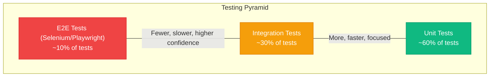
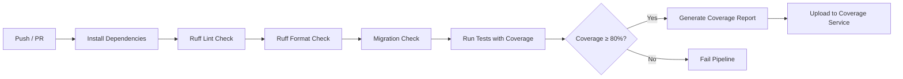

# VendorVerse — Testing Strategy

> **Document Version:** 1.0  
> **Last Updated:** 2026-07-22  
> **Status:** Approved  
> **Related Documents:** [Coding Standards](./12-coding-standards.md) · [Django Architecture](./06-django-architecture.md) · [Deployment Guide](./14-deployment-guide.md)

---

## 1. Testing Philosophy

### 1.1 Testing Pyramid



| Level | What It Tests | Speed | Django Tools |
|---|---|---|---|
| **Unit** | Service functions, validators, utilities, model methods | Fast (no DB) | `unittest.mock`, `pytest` |
| **Integration** | Views, API endpoints, signal handlers, Celery tasks | Medium (with DB) | `pytest-django`, `APIClient`, `TestCase` |
| **E2E** | Complete user workflows through the browser | Slow (browser) | Playwright / Selenium |

### 1.2 Coverage Targets

| Component | Minimum Coverage | Rationale |
|---|---|---|
| Service layer | 95% | Core business logic — must be thoroughly tested |
| Models | 90% | Validation, properties, managers |
| API views | 85% | Request/response contracts |
| Web views | 75% | Template rendering, redirects |
| Celery tasks | 80% | Async side effects |
| Utilities | 90% | Shared code used across apps |
| **Overall project** | **≥ 80%** | Industry standard for production codebases |

---

## 2. Test Framework & Tools

| Tool | Purpose | Why This Choice |
|---|---|---|
| `pytest` | Test runner | Cleaner syntax than `unittest`; powerful fixtures; plugins |
| `pytest-django` | Django integration | Database fixtures, client, settings override, live server |
| `pytest-cov` | Coverage reporting | Integrates with pytest; enforces minimums in CI |
| `factory-boy` | Test data factories | Declarative; lazy generation; traits; subfactories |
| `faker` | Realistic fake data | Used by factory-boy for realistic field values |
| `freezegun` | Time mocking | Testing time-dependent logic (expiry, scheduling) |
| `responses` / `requests-mock` | HTTP mocking | Mock Stripe and external API calls |
| `pytest-xdist` | Parallel tests | Speed up test suite on CI |
| `Playwright` | E2E browser testing | Modern, fast, multi-browser; Python API |

### 2.1 Test Configuration (`pyproject.toml`)

```toml
[tool.pytest.ini_options]
DJANGO_SETTINGS_MODULE = "config.settings.test"
python_files = ["test_*.py"]
python_classes = ["Test*"]
python_functions = ["test_*"]
addopts = [
    "--strict-markers",
    "--tb=short",
    "--reuse-db",
    "-v",
]
markers = [
    "slow: marks tests as slow (deselect with '-m \"not slow\"')",
    "e2e: marks end-to-end tests",
    "stripe: marks tests that mock Stripe API",
]
```

---

## 3. Test Organization

### 3.1 Directory Structure

```
apps/{app_name}/tests/
├── __init__.py
├── factories.py          # Factory Boy factories for this app's models
├── conftest.py            # App-specific pytest fixtures
├── test_models.py         # Model validation, properties, managers
├── test_services.py       # Service layer business logic
├── test_selectors.py      # Read query functions
├── test_views.py          # Django template views (web)
├── test_api.py            # DRF API endpoint tests
├── test_signals.py        # Signal receivers
├── test_tasks.py          # Celery task tests
└── test_permissions.py    # Permission class tests
```

### 3.2 Test Naming Convention

```python
class TestProductService:
    """Tests for apps.products.services"""

    def test_create_product_with_valid_data_succeeds(self):
        """Service creates product and returns instance."""

    def test_create_product_without_title_raises_validation_error(self):
        """Missing title raises ValidationError."""

    def test_create_product_exceeding_tier_limit_raises_error(self):
        """Vendor exceeding product limit gets BusinessRuleError."""

    def test_publish_product_sets_status_to_published(self):
        """Publishing changes status and makes product visible."""
```

Pattern: `test_{action}_{scenario}_{expected_outcome}`

---

## 4. Factory Patterns

### 4.1 Factory Examples

```python
# apps/accounts/tests/factories.py — Pattern (not application code)

# UserFactory
#   - email: faker email
#   - role: CUSTOMER (default)
#   - is_active: True
#   - Trait: vendor_user (role=VENDOR, creates associated Vendor)
#   - Trait: admin_user (role=ADMIN, is_staff=True)
#   - Trait: unverified (is_email_verified=False)

# AddressFactory
#   - user: SubFactory(UserFactory)
#   - Realistic address fields via faker

# apps/products/tests/factories.py

# CategoryFactory
#   - name: faker word
#   - slug: auto from name
#   - parent: None (override for subcategories)

# ProductFactory
#   - vendor: SubFactory(VendorFactory)
#   - category: SubFactory(CategoryFactory)
#   - title: faker sentence
#   - price: faker decimal (10-500)
#   - status: PUBLISHED (default)
#   - stock_quantity: 100
#   - Trait: out_of_stock (stock_quantity=0, status=OUT_OF_STOCK)
#   - Trait: on_sale (compare_at_price set higher than price)
#   - Trait: draft (status=DRAFT)
#   - Trait: with_images (creates 3 ProductImage instances)
#   - Trait: with_variants (creates size variants)

# apps/orders/tests/factories.py

# OrderFactory
#   - customer: SubFactory(UserFactory)
#   - status: PLACED
#   - Trait: with_items (creates 2 OrderItems)
#   - Trait: completed (status=COMPLETED, completed_at set)
#   - Trait: cancelled (status=CANCELLED)
```

### 4.2 Factory Best Practices

| Rule | Rationale |
|---|---|
| Every model has a factory | Consistent test data creation |
| Factories use minimal required fields | Tests specify only relevant fields |
| Use traits for common variations | `ProductFactory(trait__on_sale=True)` is readable |
| Use `SubFactory` for FK fields | Automatic relationship creation |
| Use `LazyFunction` for dynamic defaults | `uuid4`, `timezone.now` |
| Never use fixtures (JSON/YAML) | Factories are code, composable, explicit |

---

## 5. Test Patterns by Layer

### 5.1 Model Tests

**What to test:**
- Field validators and constraints
- Custom `save()` behavior
- Model properties and computed fields
- Custom manager/queryset methods
- `__str__()` representation
- `get_absolute_url()`

```python
# Pattern for model tests

# class TestProductModel:
#     def test_str_returns_title(self):
#     def test_slug_auto_generated_from_title(self):
#     def test_negative_price_raises_validation_error(self):
#     def test_stock_quantity_cannot_be_negative(self):
#     def test_published_manager_excludes_draft_products(self):
#     def test_discount_percentage_calculated_correctly(self):
```

### 5.2 Service Tests

**What to test:**
- Happy path (valid inputs → expected output)
- Validation failures (invalid inputs → specific exceptions)
- Business rule enforcement
- Transaction atomicity (partial failures roll back)
- Side effects (signals triggered, cache invalidated)
- Edge cases (empty cart, zero stock, concurrent access)

```python
# Pattern for service tests

# class TestOrderService:
#     def test_place_order_creates_order_with_items(self):
#     def test_place_order_decrements_product_stock(self):
#     def test_place_order_clears_customer_cart(self):
#     def test_place_order_calculates_commission_correctly(self):
#     def test_place_order_with_insufficient_stock_raises_error(self):
#     def test_place_order_with_empty_cart_raises_error(self):
#     def test_place_order_rolls_back_on_payment_failure(self):
#     def test_cancel_order_restores_stock(self):
#     def test_cancel_shipped_order_raises_error(self):
```

### 5.3 API Tests

**What to test:**
- Correct HTTP status codes
- Response body structure and content
- Authentication requirements (401 for unauthenticated)
- Permission enforcement (403 for unauthorized)
- Validation error responses (400)
- Pagination behavior
- Filtering and sorting

```python
# Pattern for API tests

# class TestProductAPI:
#     def test_list_products_returns_200(self, api_client):
#     def test_list_products_paginates_at_20(self, api_client):
#     def test_list_products_filters_by_category(self, api_client):
#     def test_create_product_requires_vendor_auth(self, api_client):
#     def test_create_product_as_customer_returns_403(self, customer_client):
#     def test_create_product_with_valid_data_returns_201(self, vendor_client):
#     def test_update_other_vendor_product_returns_403(self, vendor_client):
#     def test_search_returns_relevant_results(self, api_client):
```

### 5.4 View Tests (Web)

**What to test:**
- Correct template used
- Context data present
- Redirect behavior (login required, form submission)
- HTMX partial response (correct partial template)
- Form validation errors displayed

### 5.5 Celery Task Tests

**What to test:**
- Task executes successfully with valid inputs
- Task retries on transient failures
- Task handles permanent failures gracefully
- Side effects (emails sent, files created)

```python
# Pattern: mock external dependencies, test task logic

# class TestSendOrderConfirmationEmail:
#     @mock.patch("apps.notifications.tasks.send_email")
#     def test_sends_email_to_customer(self, mock_send):
#     
#     @mock.patch("apps.notifications.tasks.send_email", side_effect=SMTPError)
#     def test_retries_on_smtp_error(self, mock_send):
```

---

## 6. Test Fixtures (pytest)

### 6.1 Common Fixtures (`conftest.py`)

```python
# Root conftest.py — Pattern

# @pytest.fixture
# def api_client():
#     """Unauthenticated DRF APIClient."""
#
# @pytest.fixture
# def customer_user(db):
#     """Authenticated customer User instance."""
#
# @pytest.fixture
# def customer_client(api_client, customer_user):
#     """APIClient authenticated as customer."""
#
# @pytest.fixture
# def vendor_user(db):
#     """Authenticated vendor User with Vendor profile."""
#
# @pytest.fixture
# def vendor_client(api_client, vendor_user):
#     """APIClient authenticated as vendor."""
#
# @pytest.fixture
# def admin_user(db):
#     """Authenticated admin User."""
#
# @pytest.fixture
# def admin_client(api_client, admin_user):
#     """APIClient authenticated as admin."""
#
# @pytest.fixture
# def sample_category(db):
#     """A published category."""
#
# @pytest.fixture
# def sample_product(db, vendor_user):
#     """A published product with images."""
```

---

## 7. Mocking Strategy

| External Dependency | Mock Method | When |
|---|---|---|
| **Stripe API** | `unittest.mock.patch` or `responses` library | All tests (never call real Stripe) |
| **Email sending** | `django.core.mail.outbox` (built-in) | Integration tests check email content |
| **Celery tasks** | `CELERY_TASK_ALWAYS_EAGER = True` in test settings | Tasks execute synchronously in tests |
| **File storage** | `InMemoryStorage` or temp directory | Don't write to real filesystem |
| **Redis** | `django-fakeredis` or dedicated test Redis | Cache tests |
| **Time** | `freezegun.freeze_time` | Time-dependent logic (token expiry, scheduling) |

---

## 8. CI Integration

### 8.1 Test Pipeline



### 8.2 CI Commands

```bash
# Lint
ruff check .
ruff format --check .

# Migration check
python manage.py makemigrations --check --dry-run

# Tests with coverage
pytest --cov=apps --cov-report=xml --cov-report=term-missing --cov-fail-under=80

# E2E tests (separate job, only on develop/main)
pytest -m e2e --headed
```

### 8.3 Test Settings Override

| Setting | Test Value | Rationale |
|---|---|---|
| `DEBUG` | `False` | Match production behavior |
| `DATABASES` | PostgreSQL (CI service) | Match production database |
| `EMAIL_BACKEND` | `django.core.mail.backends.locmem.EmailBackend` | Capture emails in `mail.outbox` |
| `DEFAULT_FILE_STORAGE` | `django.core.files.storage.InMemoryStorage` | No filesystem writes |
| `CELERY_TASK_ALWAYS_EAGER` | `True` | Synchronous task execution |
| `CACHES` | `LocMemCache` | No Redis dependency for unit tests |
| `PASSWORD_HASHERS` | `["django.contrib.auth.hashers.MD5PasswordHasher"]` | Fast password hashing in tests |

---

*← [Coding Standards](./12-coding-standards.md) · Next: [Deployment Guide →](./14-deployment-guide.md)*
