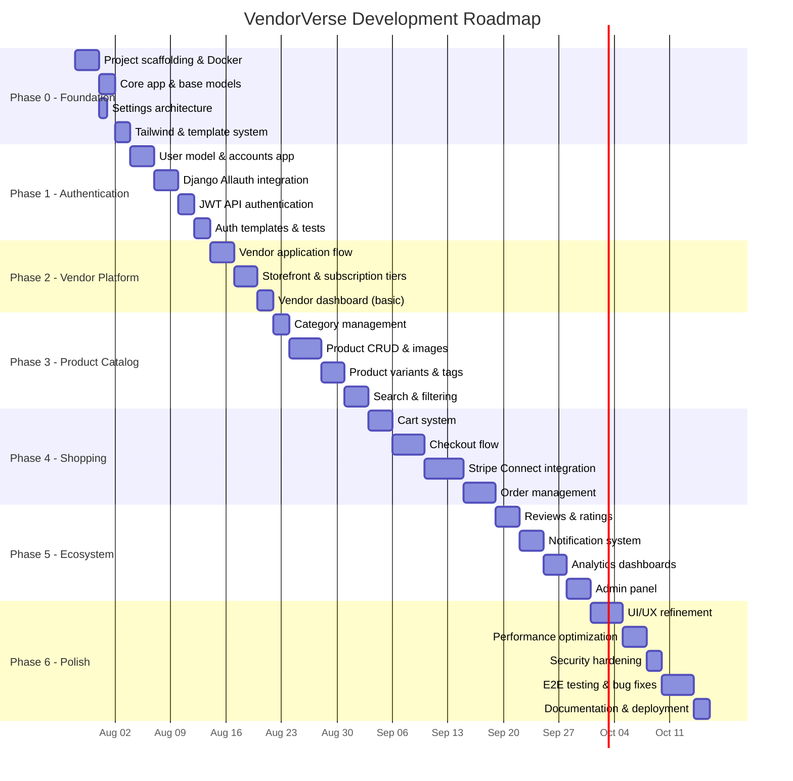
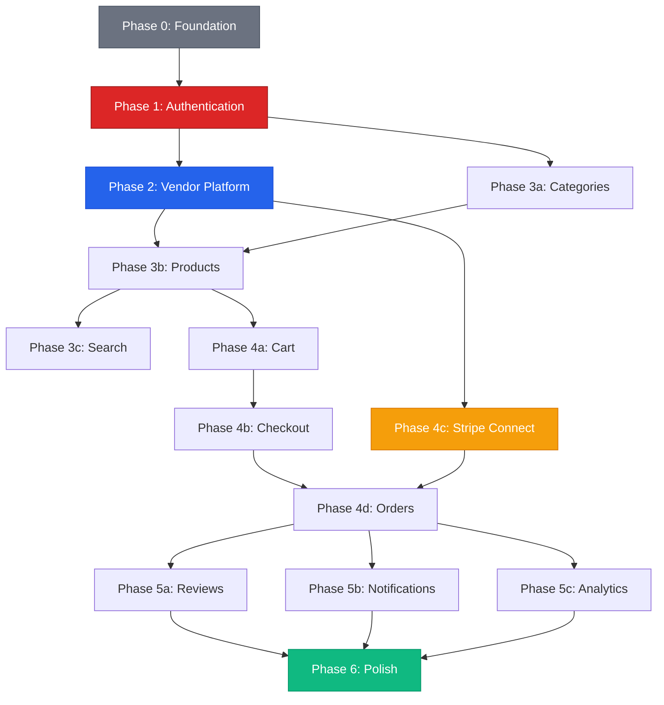

# VendorVerse — Development Roadmap

> **Document Version:** 1.0  
> **Last Updated:** 2026-07-22  
> **Status:** Approved  
> **Related Documents:** [Project Overview](./01-project-overview.md) · [Software Requirements](./02-software-requirements.md) · [System Architecture](./03-system-architecture.md)

---

## 1. Phase Overview

---

## 2. Detailed Phase Breakdown

### Phase 0: Foundation (Week 1)

**Goal:** Set up the project skeleton, Docker environment, and base infrastructure.

| Task | Deliverables | Dependencies |
|---|---|---|
| Initialize Django project | `config/`, `manage.py`, split settings | None |
| Docker setup | `Dockerfile`, `docker-compose.yml`, PostgreSQL + Redis | Django project |
| Core app | `TimeStampedModel`, `PublicIDModel`, exception hierarchy, utility mixins | Django project |
| Template system | `base.html`, layouts, includes, Tailwind CSS integration | Core app |
| API foundation | DRF config, custom response renderer, pagination, error handler | Django project |
| Dev tooling | `.ruff.toml`, pre-commit, Makefile, `.env.example` | None |

**Exit Criteria:**
- [ ] `docker compose up` starts all services
- [ ] Django admin accessible at `/admin/`
- [ ] `make test` runs (empty test suite passes)
- [ ] `make lint` passes with zero warnings
- [ ] Base template renders correctly

---

### Phase 1: Authentication & User Management (Week 2)

**Goal:** Complete user registration, login, profile management, and dual auth system.

| Task | Deliverables | Dependencies |
|---|---|---|
| Custom User model | `User` with email-primary auth, role field | Core app |
| UserProfile & Address | Profile model, address CRUD | User model |
| Django Allauth setup | Registration, email verification, social auth (Google/GitHub) | User model |
| Auth templates | Login, register, password reset, email verify pages | Template system |
| JWT API auth | SimpleJWT setup, token obtain/refresh/blacklist endpoints | DRF foundation |
| Profile views & API | Profile page, address management, both web and API | UserProfile |
| Audit logging | AuditLog model, login/logout/password change signals | User model |
| Tests | User model, auth services, auth API endpoints | All above |

**Exit Criteria:**
- [ ] User can register via email and social auth
- [ ] Email verification works end-to-end
- [ ] Login/logout works for both session and JWT
- [ ] Profile and address CRUD functional
- [ ] Auth tests pass with ≥ 80% coverage

---

### Phase 2: Vendor Platform (Week 3)

**Goal:** Enable users to apply as vendors, manage storefronts, and view a basic dashboard.

| Task | Deliverables | Dependencies |
|---|---|---|
| Vendor application | Application form, admin review workflow | User auth |
| Vendor model & storefront | Vendor, Storefront models; storefront setup pages | Vendor application |
| Subscription tiers | SubscriptionTier model, tier selection, commission rates | Vendor model |
| Vendor dashboard | Dashboard layout, placeholder stat cards | Vendor model |
| Public storefront view | Public vendor page with info and (empty) product grid | Storefront |
| Admin vendor management | Admin views: applications queue, vendor list, approve/reject/suspend | Vendor model |
| Tests | Vendor services, application flow, permissions | All above |

**Exit Criteria:**
- [ ] Customer can submit vendor application
- [ ] Admin can approve/reject applications
- [ ] Approved vendor can set up storefront
- [ ] Vendor dashboard renders with layout
- [ ] Public storefront page accessible

---

### Phase 3: Product Catalog (Weeks 4–5)

**Goal:** Full product management for vendors, category browsing, and search for customers.

| Task | Deliverables | Dependencies |
|---|---|---|
| Category management | Category model (hierarchical), admin category CRUD, mega-menu | Core |
| Product CRUD | Product model, vendor product create/edit/delete views, image upload | Vendor, Category |
| Image processing | Celery tasks for resize, WebP conversion, thumbnail generation | Celery, Products |
| Product variants | Variant model, variant management in product form | Product |
| Tags & attributes | ProductTag model, attribute JSONField, tag management | Product |
| Product listing (customer) | Product grid, category browsing, pagination (HTMX) | Product, Category |
| Product detail (customer) | Detail page with gallery, variants, add-to-cart, tabs | Product |
| PostgreSQL FTS | Search vector, trigram similarity, search endpoint, autocomplete | Product |
| Filters & sorting | django-filter integration, price/rating/category filters | Product listing |
| Tests | Product services, selectors, search, API endpoints | All above |

**Exit Criteria:**
- [ ] Vendor can create products with images and variants
- [ ] Customer can browse by category
- [ ] Full-text search returns relevant, typo-tolerant results
- [ ] Product detail page renders with gallery and variant selection
- [ ] Filters and sorting work on listing pages

---

### Phase 4: Shopping & Payments (Weeks 6–7)

**Goal:** Complete shopping flow from cart to order delivery with Stripe payments.

| Task | Deliverables | Dependencies |
|---|---|---|
| Cart system | Cart/CartItem models, add/update/remove (HTMX), cart page | Products |
| Cart validation | Stock check, price validation, anonymous cart merge on login | Cart, Auth |
| Checkout flow | Multi-step: address → review → payment, HTMX steps | Cart, Addresses |
| Stripe Connect setup | Vendor Stripe onboarding, platform account configuration | Vendors |
| Payment processing | PaymentIntent creation, commission splitting, Stripe Elements | Checkout, Stripe |
| Webhook handling | Stripe webhook endpoint, payment/payout event processing | Payments |
| Order creation | Order/OrderItem models, per-vendor sub-orders, stock decrement | Checkout |
| Order lifecycle | Status transitions, vendor confirmation/shipping, tracking entry | Orders |
| Customer order views | Order history, order detail, status timeline | Orders |
| Vendor order views | Vendor order management, status update actions | Orders, Vendor |
| Cancellation & returns | Cancel order, return request flow, refund processing | Orders, Payments |
| Invoice generation | PDF invoice via ReportLab/WeasyPrint | Orders |
| Tests | Cart services, checkout flow, payment (mocked), order state machine | All above |

**Exit Criteria:**
- [ ] Customer can add items to cart, adjust quantity, remove items
- [ ] Multi-step checkout works end-to-end
- [ ] Stripe payment processes in test mode
- [ ] Multi-vendor orders create correct sub-orders with commission splits
- [ ] Vendor can confirm, ship, and track orders
- [ ] Customer can cancel pre-shipped orders
- [ ] Invoice PDF generates correctly

---

### Phase 5: Ecosystem Features (Week 8)

**Goal:** Build the community and operational features that make the marketplace viable.

| Task | Deliverables | Dependencies |
|---|---|---|
| Reviews & ratings | Review model, review form, product/vendor rating aggregation | Orders (delivered) |
| Review moderation | Auto-moderation, admin queue, vendor responses | Reviews |
| Notification system | Notification model, email templates, in-app notification center | All events |
| Notification preferences | User notification settings, per-category opt-out | Notifications |
| Vendor analytics | Revenue charts, top products, order trends, earnings dashboard | Orders, Products |
| Admin analytics | GMV trends, vendor performance, platform health metrics | Orders, Vendors |
| Admin panel | Custom admin: site settings, commission config, user management | All modules |
| Coupons | Coupon model, validation, application at checkout | Orders |
| Tests | Reviews, notifications, analytics queries | All above |

**Exit Criteria:**
- [ ] Verified customers can write reviews with star ratings
- [ ] Product and vendor ratings aggregate correctly
- [ ] Email notifications sent for all critical events
- [ ] In-app notification center functional
- [ ] Vendor dashboard shows real analytics data
- [ ] Admin panel operational for all management tasks

---

### Phase 6: Polish & Launch Prep (Weeks 9–10)

**Goal:** Refine UX, optimize performance, harden security, and prepare for deployment.

| Task | Deliverables | Dependencies |
|---|---|---|
| UI/UX refinement | Responsive testing, accessibility audit, micro-animations, error pages | All UI |
| HTMX polish | Loading states, skeleton screens, toast notifications | All HTMX interactions |
| Performance optimization | Cache implementation, query optimization, Lighthouse audit | All modules |
| Security hardening | CSP headers, rate limiting, input sanitization audit, pen-test checklist | All modules |
| E2E test suite | Playwright tests for critical flows (register → shop → checkout) | All flows |
| Bug fixes | Address issues found during testing | All modules |
| Deployment setup | Production Docker, Nginx config, SSL, CI/CD pipeline | Infrastructure |
| Documentation finalize | README, API docs, app-level READMEs | All modules |
| Seed data (demo) | Realistic demo data for presentation | All models |

**Exit Criteria:**
- [ ] Lighthouse score ≥ 90 (performance), ≥ 95 (accessibility)
- [ ] All E2E critical path tests pass
- [ ] Zero critical/high security findings
- [ ] Application deploys to staging successfully
- [ ] Demo data creates a realistic marketplace experience
- [ ] README complete with setup instructions

---

## 3. MVP Scope Definition

### What IS in MVP (Must Ship)

| Feature | Rationale |
|---|---|
| User registration, login, profiles | Core functionality |
| Vendor application and approval | Multi-vendor platform requirement |
| Product CRUD with images | Marketplace foundation |
| Category browsing and search | Product discovery |
| Shopping cart and checkout | Revenue generation |
| Stripe payment processing | Payment is non-negotiable |
| Order lifecycle management | Complete transaction flow |
| Basic reviews and ratings | Trust building |
| Email notifications | Essential communication |
| Vendor and admin dashboards | Platform operations |

### What is NOT in MVP (Post-Launch)

| Feature | Phase |
|---|---|
| Coupon/discount system | Phase 5 if time allows; otherwise post-launch |
| Review images | Post-launch enhancement |
| Bulk product import (CSV) | Post-launch |
| Advanced analytics and reports | Post-launch |
| Wishlists | Post-launch convenience feature |
| In-app notification center | Post-launch (email sufficient initially) |

---

## 4. Risk-Adjusted Timeline

| Risk | Impact on Timeline | Mitigation |
|---|---|---|
| Stripe Connect integration more complex than estimated | +1 week | Start Stripe research in Phase 2; use test mode early |
| Multi-vendor cart/checkout edge cases | +3–5 days | Design comprehensive test scenarios upfront |
| Image processing pipeline issues | +2 days | Use simple Pillow resize first; defer WebP to polish phase |
| PostgreSQL FTS insufficient quality | +2 days | Have django-watson or pg_search as fallback |
| Scope creep from "one more feature" | +1–2 weeks | Strict MVP definition; defer to post-launch backlog |

**Total Estimated Duration:** 10 weeks (with buffer built into Phase 6)

---

## 5. Dependency Graph

---

*← [Deployment Guide](./14-deployment-guide.md) · Next: [PROJECT_CONTEXT →](./PROJECT_CONTEXT.md)*
